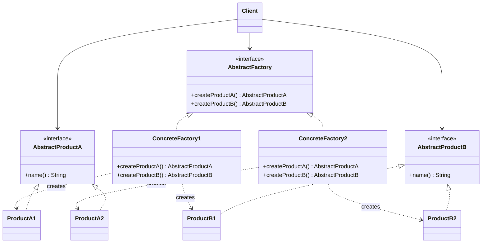

# 🌰 Abstract Factory

*Creational pattern. Also known as* Kit.

## Intent

Provide an interface for creating families of related or dependent objects
without specifying their concrete classes [1, p. 87].

## Motivation

Some systems must be configurable with one of several *families* of products,
where the members of a family are designed to be used together. A user
interface toolkit that supports several look-and-feel standards is the
canonical case: a window, a scroll bar and a button must all belong to the same
standard. Instantiating concrete classes throughout the client code makes it
hard to guarantee that consistency and hard to switch families later.

Abstract Factory moves all creation into one object per family. The client is
written against the abstract factory and the abstract products only, so an
entire family can be exchanged by substituting a single factory instance.

## Structure



## Participants

| Role [1] | Responsibility | Java | Python | TypeScript | JavaScript |
|---|---|---|---|---|---|
| AbstractFactory | Declares one creation operation per abstract product: `createProductA()`, `createProductB()`. | [`AbstractFactory`](../../java/src/main/java/com/penapereira/patterns/abstractfactory/AbstractFactory.java) | [`AbstractFactory`](../../python/src/patterns/abstractfactory/__init__.py) (Protocol; `create_product_a`, `create_product_b`) | [`AbstractFactory`](../../typescript/src/abstract-factory/abstract-factory.ts) | implicit: any object with both `create` methods ([`abstract-factory.js`](../../javascript/src/abstract-factory/abstract-factory.js)) |
| ConcreteFactory | Implements the operations for one family. | [`ConcreteFactory1`](../../java/src/main/java/com/penapereira/patterns/abstractfactory/ConcreteFactory1.java), [`ConcreteFactory2`](../../java/src/main/java/com/penapereira/patterns/abstractfactory/ConcreteFactory2.java) | `ConcreteFactory1`, `ConcreteFactory2` | `ConcreteFactory1`, `ConcreteFactory2` | `ConcreteFactory1`, `ConcreteFactory2` |
| AbstractProduct | Declares the interface of each kind of product; both expose only `name()`. | [`AbstractProductA`](../../java/src/main/java/com/penapereira/patterns/abstractfactory/AbstractProductA.java), [`AbstractProductB`](../../java/src/main/java/com/penapereira/patterns/abstractfactory/AbstractProductB.java) | `AbstractProductA`, `AbstractProductB` (Protocols) | `AbstractProductA`, `AbstractProductB` | implicit: any object with `name()` |
| ConcreteProduct | The products themselves; the digit denotes the family. | [`ProductA1`](../../java/src/main/java/com/penapereira/patterns/abstractfactory/ProductA1.java), `ProductA2`, `ProductB1`, `ProductB2` | `ProductA1`, `ProductA2`, `ProductB1`, `ProductB2` | `ProductA1`, `ProductA2`, `ProductB1`, `ProductB2` | `ProductA1`, `ProductA2`, `ProductB1`, `ProductB2` |
| Client | Uses only the abstract types. | [`AbstractFactoryExample`](../../java/src/main/java/com/penapereira/patterns/abstractfactory/AbstractFactoryExample.java) | `AbstractFactoryExample` | [`abstractFactoryExample`](../../typescript/src/abstract-factory/example.ts) | [`abstractFactoryExample`](../../javascript/src/abstract-factory/example.js) |

## The example

The client creates one instance of each concrete factory and asks each for
both of its products, printing the product names. Four products appear, two
per family:

```
Executing Abstract Factory Pattern Implementation
  ProductA1
  ProductB1
  ProductA2
  ProductB2
```

The client never mentions a concrete product class. Replacing
`new ConcreteFactory1()` with `new ConcreteFactory2()` is the only change
needed to switch the whole family. Run it with `make run P=abstract-factory`.

## Consequences

* **Isolates concrete classes.** Product class names appear only inside the
  concrete factories.
* **Makes exchanging product families easy** and **promotes consistency among
  products**, since a factory can only produce members of its own family.
* **Supporting new kinds of products is difficult.** Adding a `ProductC` means
  extending the `AbstractFactory` interface and every concrete factory. The
  pattern fixes the *set of product kinds* while leaving the *set of families*
  open, which is the opposite trade-off from Factory Method.

## Language notes

* **Java.** `javax.xml.parsers.DocumentBuilderFactory` and the other JAXP
  factories follow this pattern: the client obtains a factory and receives a
  coherent family of parser objects without knowing the provider. In
  applications built on a dependency-injection container, the container itself
  often plays the abstract factory role, one reason the pattern appears less
  often in hand-written code today [2].
* **Python.** The abstract factory and abstract products are `Protocol`s; the
  concrete classes do not inherit from them. Because classes are first-class
  objects, a family is often expressed without any factory class at all: a
  module, or a dict mapping product kind to class, plays the role. The explicit
  classes are kept here to mirror the diagram.
* **TypeScript.** Interfaces are structural, so `implements` is documentation
  rather than a requirement; a factory could equally be a plain object literal
  with two functions.
* **JavaScript.** There are no abstract types in the code at all. Any object
  with `createProductA()` and `createProductB()` is a factory, and any object
  with `name()` is a product. Only the concrete classes exist, which shows how
  much of this pattern is type ceremony in a dynamically typed language.

## Related patterns

* **Factory Method**: concrete factories are frequently implemented with factory
  methods, one per product.
* **Singleton**: an application usually needs a single instance of a given
  concrete factory.
* **Prototype**: an alternative way to implement the concrete factories when
  families are many.

## References

See [`references.md`](../references.md).

1. Gamma, Helm, Johnson and Vlissides, *Design Patterns*, pp. 87–95.
2. Bloch, *Effective Java*, 3rd ed., Items 1 and 5.
3. Freeman and Robson, *Head First Design Patterns*, 2nd ed., ch. 4.
