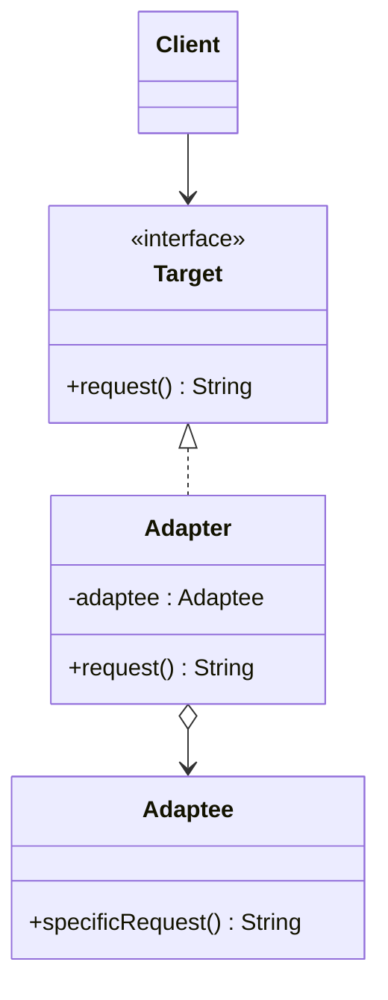

# 🔌 Adapter

*Structural pattern. Also known as* Wrapper.

## Intent

Convert the interface of a class into another interface clients expect.
Adapter lets classes work together that could not otherwise because of
incompatible interfaces [1, p. 139].

## Motivation

A useful class often has an interface that does not match the one a client was
written against, and neither can be changed: the client may be third-party
code and the class may come from a library. Rewriting either to fit the other
is costly or impossible. An adapter sits between them, implementing the
interface the client expects and translating each call into the operations the
existing class provides.

Gamma et al. distinguish the **class adapter**, which inherits from both the
target and the adaptee, from the **object adapter**, which implements the
target and *holds* the adaptee [1, p. 141]. The object adapter is the form
shown here in every language.

## Structure



## Participants

| Role [1] | Responsibility | Java | Python | TypeScript | JavaScript |
|---|---|---|---|---|---|
| Target | The domain-specific interface the client uses: `request()`. | [`Target`](../../java/src/main/java/com/penapereira/patterns/adapter/Target.java) | [`Target`](../../python/src/patterns/adapter/__init__.py) (Protocol) | [`Target`](../../typescript/src/adapter/adapter.ts) | implicit: any object with `request()` ([`adapter.js`](../../javascript/src/adapter/adapter.js)) |
| Adaptee | An existing class with a useful but incompatible operation, `specificRequest()`. | [`Adaptee`](../../java/src/main/java/com/penapereira/patterns/adapter/Adaptee.java) | `Adaptee` (`specific_request`) | `Adaptee` | `Adaptee` |
| Adapter | Implements `Target` by delegating to the `Adaptee` it was constructed with. | [`Adapter`](../../java/src/main/java/com/penapereira/patterns/adapter/Adapter.java) | `Adapter` | `Adapter` | `Adapter` |
| Client | Collaborates with objects through `Target` only. | [`AdapterExample`](../../java/src/main/java/com/penapereira/patterns/adapter/AdapterExample.java) | `AdapterExample` | [`adapterExample`](../../typescript/src/adapter/example.ts) | [`adapterExample`](../../javascript/src/adapter/example.js) |

## The example

The client creates an `Adaptee`, wraps it in an `Adapter` and calls
`request()` through the `Target` type. The adapter's answer makes the
delegation visible:

```
Executing Adapter Pattern Implementation
  Adapter(Adaptee)
```

Run it with `make run P=adapter`.

## Consequences

For the object adapter form used here:

* **One adapter serves many adaptees.** Because it holds a reference rather
  than inheriting, the same `Adapter` works with any `Adaptee` or subclass of
  it; the tests pass a stand-in adaptee to prove it.
* **Overriding adaptee behaviour is harder.** Changing what the adaptee does
  requires subclassing it and passing the subclass in, whereas a class adapter
  could override directly.
* **How much adapting is needed varies** from renaming a method, as here, to
  synthesising an entirely different protocol.

## Language notes

* **Java.** Single inheritance rules out a class adapter for two classes,
  which is why the object form dominates. `java.io.InputStreamReader` adapts a
  byte-oriented `InputStream` to the character-oriented `Reader`, and
  `Arrays.asList` adapts an array to `List`.
* **Python.** Multiple inheritance makes the class adapter possible
  (`class Adapter(Target, Adaptee)`), but composition is still preferred. Since
  `Target` is a Protocol, the adapter conforms by having `request()`; no
  declaration is needed. `io.TextIOWrapper` is the standard library's adapter
  from bytes to text.
* **TypeScript.** Structural typing means any object with `request()` is a
  `Target`; an adapter can even be a one-line object literal
  `{ request: () => ... }` closing over the adaptee.
* **JavaScript.** Same as TypeScript without the declaration. Node's
  `stream.Readable.from(iterable)` is an adapter from iterables to streams.

## Related patterns

* **Bridge** has a similar structure but a different purpose: it separates an
  abstraction from its implementation up front, whereas Adapter reconciles
  interfaces after the fact.
* **Decorator** also wraps an object, but preserves its interface and adds
  behaviour rather than translating.
* **Proxy** wraps an object with the same interface to control access to it.

## References

See [`references.md`](../references.md).

1. Gamma, Helm, Johnson and Vlissides, *Design Patterns*, pp. 139–150.
3. Freeman and Robson, *Head First Design Patterns*, 2nd ed., ch. 7.
