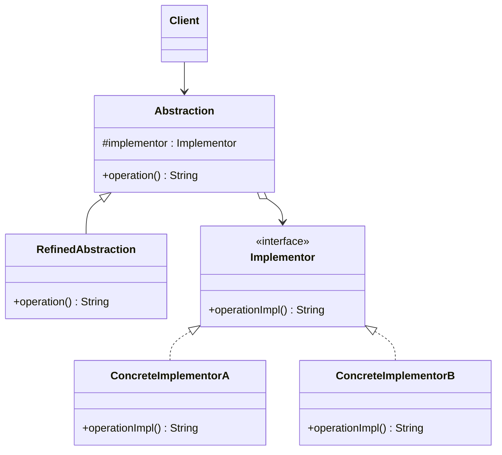

# 🌉 Bridge

*Structural pattern. Also known as* Handle/Body.

## Intent

Decouple an abstraction from its implementation so that the two can vary
independently [1, p. 151].

## Motivation

A portable window abstraction must work on several window systems. Putting the
platform-specific code in subclasses of `Window` (`XWindow`, `PMWindow`) breaks
down as soon as the abstraction itself needs subclasses too (`IconWindow`,
`TransientWindow`): every combination needs a class, and client code is tied
to a platform when it instantiates one. Bridge separates the two hierarchies.
The abstraction holds a reference to an *implementor* object and forwards the
platform-dependent primitives to it; the abstraction's own subclasses add
behaviour, the implementor's subclasses supply platforms, and the two are
combined at run time.

## Structure



## Participants

| Role [1] | Responsibility | Java | Python | TypeScript | JavaScript |
|---|---|---|---|---|---|
| Abstraction | Defines the abstraction's interface and holds the implementor; `operation()` forwards the primitive to it. | [`Abstraction`](../../java/src/main/java/com/penapereira/patterns/bridge/Abstraction.java) | [`Abstraction`](../../python/src/patterns/bridge/abstraction.py) | [`Abstraction`](../../typescript/src/bridge/abstraction.ts) | [`Abstraction`](../../javascript/src/bridge/bridge.js) |
| RefinedAbstraction | Extends the abstraction's interface or behaviour. | [`RefinedAbstraction`](../../java/src/main/java/com/penapereira/patterns/bridge/RefinedAbstraction.java) | `RefinedAbstraction` | `RefinedAbstraction` | `RefinedAbstraction` |
| Implementor | The interface for implementation classes; primitive operations only. | [`Implementor`](../../java/src/main/java/com/penapereira/patterns/bridge/Implementor.java) | `Implementor` (Protocol, `operation_impl`) | `Implementor` | implicit: any object with `operationImpl()` |
| ConcreteImplementor | Implements the Implementor interface. | [`ConcreteImplementorA`](../../java/src/main/java/com/penapereira/patterns/bridge/ConcreteImplementorA.java), `ConcreteImplementorB` | `ConcreteImplementorA`, `ConcreteImplementorB` | `ConcreteImplementorA`, `ConcreteImplementorB` | `ConcreteImplementorA`, `ConcreteImplementorB` |
| Client | Combines an abstraction with an implementor. | [`BridgeExample`](../../java/src/main/java/com/penapereira/patterns/bridge/BridgeExample.java) | `BridgeExample` | [`bridgeExample`](../../typescript/src/bridge/example.ts) | [`bridgeExample`](../../javascript/src/bridge/example.js) |

## The example

The client pairs each of the two abstractions with each of the two
implementors. Four combinations from four classes, none of which knows more
than one side of the bridge:

```
Executing Bridge Pattern Implementation
  Abstraction(ConcreteImplementorA)
  Abstraction(ConcreteImplementorB)
  RefinedAbstraction(ConcreteImplementorA)
  RefinedAbstraction(ConcreteImplementorB)
```

Run it with `make run P=bridge`.

## Consequences

* **Decoupling interface and implementation.** The implementation can be
  chosen, or even changed, at run time.
* **Improved extensibility.** Both hierarchies grow independently; adding a
  platform never touches the abstraction and vice versa.
* **Hiding implementation details from clients**, which see only the
  abstraction.
* **Indirection cost** and one more object per abstraction instance.

## Language notes

* **Java.** JDBC is the everyday bridge: `java.sql.Connection` and friends are
  the abstraction, each vendor's driver the concrete implementor, and
  `DriverManager` chooses the implementor at run time. Historically AWT
  components delegated to platform *peers* in exactly this shape.
* **Python.** With duck typing the `Implementor` Protocol is documentation;
  what matters is that the abstraction stores an object and calls one method
  on it. The pattern is therefore mostly a discipline of *where* the
  platform-specific code lives.
* **TypeScript.** The structural `Implementor` interface lets a concrete
  implementor be a plain object literal, and `protected readonly implementor`
  gives refined abstractions access without exposing it to clients.
* **JavaScript.** Same as TypeScript without types. Rendering libraries that
  target both DOM and canvas through one drawing API are bridges.

## Related patterns

* **Adapter** makes unrelated classes work together after they were designed;
  Bridge is designed in up front to let abstraction and implementation vary
  independently.
* **Abstract Factory** can create and configure a particular bridge.
* **Strategy** also delegates to an interchangeable object, but varies an
  algorithm rather than an implementation platform, and has no second
  hierarchy on the abstraction side.

## References

See [`references.md`](../references.md).

1. Gamma, Helm, Johnson and Vlissides, *Design Patterns*, pp. 151–161.
