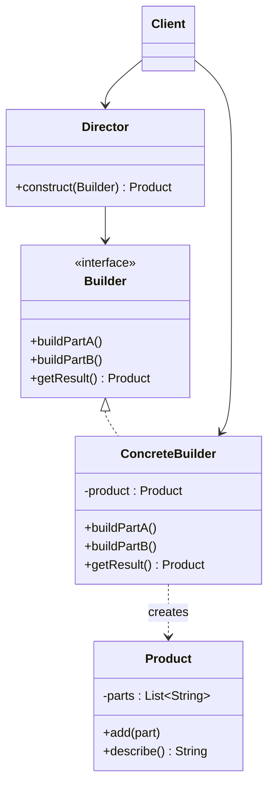

# 👷 Builder

*Creational pattern.*

## Intent

Separate the construction of a complex object from its representation so that
the same construction process can create different representations [1, p. 97].

## Motivation

A reader for the RTF document format should be able to convert RTF to many
text formats, and new formats should be easy to add without changing the
reader. The reader (the *director*) parses the document once, issuing a step
for each token it recognises; a *builder* object receives those steps and
assembles the target representation. An ASCII builder ignores formatting, a
TeX builder emits markup, a widget builder creates a user-interface tree, all
driven by the same parsing algorithm.

## Structure



## Participants

| Role [1] | Responsibility | Java | Python | TypeScript | JavaScript |
|---|---|---|---|---|---|
| Builder | The abstract interface for creating parts of a product. | [`Builder`](../../java/src/main/java/com/penapereira/patterns/builder/Builder.java) | [`Builder`](../../python/src/patterns/builder/builder.py) (Protocol; `build_part_a`, `build_part_b`, `get_result`) | [`Builder`](../../typescript/src/builder/builder.ts) | implicit: any object with the three methods |
| ConcreteBuilder | Constructs and assembles parts; keeps the representation and hands it out. | [`ConcreteBuilder`](../../java/src/main/java/com/penapereira/patterns/builder/ConcreteBuilder.java) | [`ConcreteBuilder`](../../python/src/patterns/builder/concrete_builder.py) | [`ConcreteBuilder`](../../typescript/src/builder/concrete-builder.ts) | [`ConcreteBuilder`](../../javascript/src/builder/concrete-builder.js) |
| Director | Constructs an object using the Builder interface; owns the *sequence* of steps. | [`Director`](../../java/src/main/java/com/penapereira/patterns/builder/Director.java) | [`Director`](../../python/src/patterns/builder/director.py) | [`Director`](../../typescript/src/builder/director.ts) | [`Director`](../../javascript/src/builder/director.js) |
| Product | The complex object under construction. | [`Product`](../../java/src/main/java/com/penapereira/patterns/builder/Product.java) | [`Product`](../../python/src/patterns/builder/product.py) | [`Product`](../../typescript/src/builder/product.ts) | [`Product`](../../javascript/src/builder/product.js) |
| Client | Creates a builder, hands it to the director, retrieves the product. | [`BuilderExample`](../../java/src/main/java/com/penapereira/patterns/builder/BuilderExample.java) | [`BuilderExample`](../../python/src/patterns/builder/example.py) | [`builderExample`](../../typescript/src/builder/example.ts) | [`builderExample`](../../javascript/src/builder/example.js) |
## The example

The director drives a concrete builder through its fixed sequence, part A then
part B. The client then uses a builder directly, requesting only part B, to
show that the *steps* belong to the builder and the *order* to the director:

```
Executing Builder Pattern Implementation
  Director.construct(ConcreteBuilder): Product(PartA, PartB)
  ConcreteBuilder alone, only part B: Product(PartB)
```

Run it with `make run P=builder`.

## Consequences

* **Lets you vary a product's internal representation** by supplying a
  different builder to the same director.
* **Isolates code for construction and representation.** Clients never see
  the product's internal structure.
* **Finer control over the construction process**: the product is built step
  by step and retrieved only at the end.
* One more class per representation, and the director and builder interface
  must agree on the set of steps.

## Language notes

* **Java.** The Builder that Java programmers usually mean is Bloch's [2,
  Item 2]: a fluent inner class replacing telescoping constructors
  (`new Pizza.Builder().size(12).topping(HAM).build()`). It shares the
  step-by-step assembly and `build()` with GoF's pattern but has no director
  and only one representation. `StringBuilder` and `Stream.Builder` are of the
  same kind.
* **Python.** Keyword arguments, default values and `dataclasses` remove most
  of the need for fluent builders; GoF's Builder survives where a single
  traversal must produce different outputs, for example the `ast` module's
  `NodeVisitor` subclasses that emit code or documentation from one tree walk.
* **TypeScript.** Object literals with optional properties replace fluent
  builders; the director/builder split is still valuable for emitting
  different formats from one walk, as in compiler and documentation tooling.
* **JavaScript.** Same as TypeScript. Chained APIs such as query builders are
  Bloch-style builders.

## Related patterns

* **Abstract Factory** also constructs complex objects, but returns the
  product immediately, whereas Builder returns it as a final step after a
  sequence of calls.
* **Composite** is what the builder often builds.

## References

See [`references.md`](../references.md).

1. Gamma, Helm, Johnson and Vlissides, *Design Patterns*, pp. 97–106.
2. Bloch, *Effective Java*, 3rd ed., Item 2.
