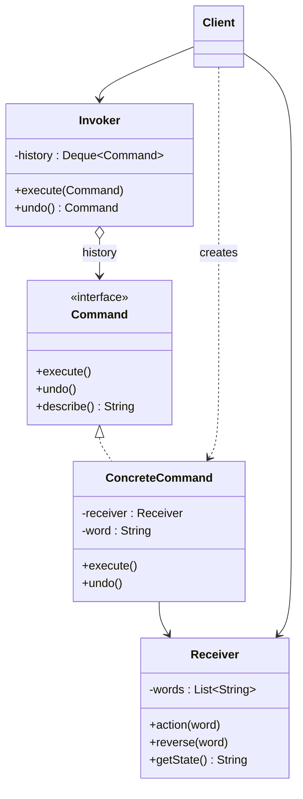

# 👫 Command

*Behavioural pattern. Also known as* Action, Transaction.

## Intent

Encapsulate a request as an object, thereby letting you parameterise clients
with different requests, queue or log requests, and support undoable operations
[1, p. 233].

## Motivation

A user-interface toolkit provides buttons and menu items but cannot know what
they should do in a given application, and the same action (paste) may be
reachable from a menu, a toolbar button and a keyboard shortcut. Turning the
request into an object solves both: the toolkit's `MenuItem` holds a `Command`
and calls `execute()` without knowing what it does, the application supplies
concrete commands bound to the objects they act on, and because a command is an
object it can be stored in a history and asked to `undo()` itself later.

## Structure



## Participants

| Role [1] | Responsibility | Java | Python | TypeScript | JavaScript |
|---|---|---|---|---|---|
| Command | Declares the interface for executing (and undoing) an operation. | [`Command`](../../java/src/main/java/com/penapereira/patterns/command/Command.java) | [`Command`](../../python/src/patterns/command/__init__.py) (Protocol) | [`Command`](../../typescript/src/command/command.ts) | implicit: any object with `execute`, `undo`, `describe` |
| ConcreteCommand | Binds a receiver to an action; `execute()` invokes it, `undo()` reverses it. | [`ConcreteCommand`](../../java/src/main/java/com/penapereira/patterns/command/ConcreteCommand.java) | `ConcreteCommand` | `ConcreteCommand` | `ConcreteCommand` |
| Receiver | Knows how to perform the operations associated with a request. | [`Receiver`](../../java/src/main/java/com/penapereira/patterns/command/Receiver.java) | `Receiver` (`action`, `reverse`, `get_state`) | `Receiver` | `Receiver` |
| Invoker | Asks the command to carry out the request; keeps the history for undo. | [`Invoker`](../../java/src/main/java/com/penapereira/patterns/command/Invoker.java) | `Invoker` | `Invoker` | `Invoker` |
| Client | Creates concrete commands and sets their receiver; hands them to the invoker. | [`CommandExample`](../../java/src/main/java/com/penapereira/patterns/command/CommandExample.java) | `CommandExample` | [`commandExample`](../../typescript/src/command/example.ts) | [`commandExample`](../../javascript/src/command/example.js) |

## The example

The client creates two commands that append words to a receiver, hands them to
the invoker, then asks the invoker to undo the last one:

```
Executing Command Pattern Implementation
  Executed ConcreteCommand(Hello): state = Hello
  Executed ConcreteCommand(World): state = Hello World
  Undone ConcreteCommand(World): state = Hello
```

Run it with `make run P=command`.

## Consequences

* **Decouples the object that invokes the operation from the one that knows
  how to perform it.**
* **Commands are first-class objects**: they can be stored, passed, queued,
  logged and, given an `undo()`, reversed.
* **Composable**: a *macro command* is a command holding a list of commands
  (Composite).
* **Easy to add new commands** without changing existing classes.
* Undo needs the command to capture enough state to reverse itself, which for
  large operations may mean Memento.

## Language notes

* **Java.** `Runnable` and `Callable` are commands without receivers or undo;
  `javax.swing.Action` and `UndoManager` with `UndoableEdit` are the full
  pattern in Swing. Since Java 8 a stateless command is a lambda, but undo
  requires the object form shown here.
* **Python.** Functions are first-class, so a command without undo is just a
  callable, and `functools.partial` binds the receiver; a class earns its place
  when `undo()` or a description is needed, as here.
* **TypeScript.** Redux-style actions are serialisable commands processed by a
  reducer (the receiver); the invoker is the store. Undo/redo libraries keep
  exactly the history the `Invoker` keeps.
* **JavaScript.** Event handlers and job queues (`setTimeout`, message queues)
  treat callbacks as commands; the class form is used when the command must
  carry state for undo.

## Related patterns

* **Composite** implements macro commands.
* **Memento** keeps the state a command needs to undo its effects.
* **Prototype**: a command that must be copied before being placed on the
  history list acts as a prototype.
* **Chain of Responsibility**: the request travelling down the chain is often
  a command object.

## References

See [`references.md`](../references.md).

1. Gamma, Helm, Johnson and Vlissides, *Design Patterns*, pp. 233–242.
3. Freeman and Robson, *Head First Design Patterns*, 2nd ed., ch. 6.
