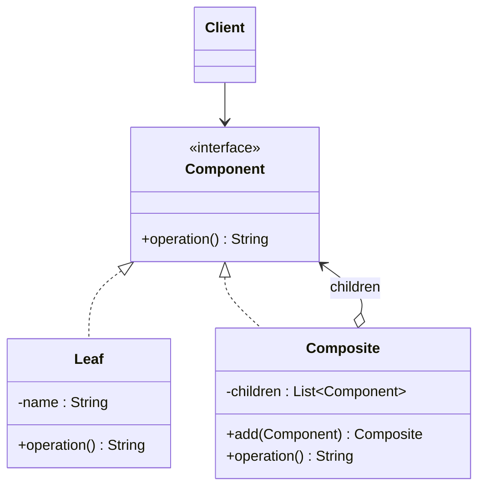

# 🌿 Composite

*Structural pattern.*

## Intent

Compose objects into tree structures to represent part-whole hierarchies.
Composite lets clients treat individual objects and compositions of objects
uniformly [1, p. 163].

## Motivation

A drawing editor lets users build complex diagrams out of simple primitives and
group them; groups can be grouped again. Code that distinguishes primitives
from groups everywhere is complex and makes the two kinds of object different
to the client. Composite gives primitives and groups one abstract interface:
a `Leaf` implements it directly, a `Composite` implements it by delegating to
its children and combining the results. A client that holds a `Component` need
not know, or care, whether it is a single object or a whole tree.

## Structure



## Participants

| Role [1] | Responsibility | Java | Python | TypeScript | JavaScript |
|---|---|---|---|---|---|
| Component | The interface for objects in the composition: `operation()`. | [`Component`](../../java/src/main/java/com/penapereira/patterns/composite/Component.java) | [`Component`](../../python/src/patterns/composite/component.py) (Protocol) | [`Component`](../../typescript/src/composite/composite.ts) | implicit: any object with `operation()` |
| Leaf | A primitive with no children. | [`Leaf`](../../java/src/main/java/com/penapereira/patterns/composite/Leaf.java) | `Leaf` | `Leaf` | `Leaf` |
| Composite | Stores children, implements child management (`add`) and delegates `operation()` to them. | [`Composite`](../../java/src/main/java/com/penapereira/patterns/composite/Composite.java) | `Composite` | `Composite` | `Composite` |
| Client | Manipulates objects through `Component`. | [`CompositeExample`](../../java/src/main/java/com/penapereira/patterns/composite/CompositeExample.java) | `CompositeExample` | [`compositeExample`](../../typescript/src/composite/example.ts) | [`compositeExample`](../../javascript/src/composite/example.js) |

Gamma et al. discuss where to declare child management [1, p. 167]. Declaring
`add` on `Component` gives *transparency* (every component looks the same) at
the cost of *safety* (adding to a leaf is meaningless and must fail at run
time). These implementations choose safety: only `Composite` has `add`, so the
compiler or the interpreter refuses `leaf.add(...)`.

## The example

The client prints a lone leaf, then a tree with two leaves and a nested
composite, through the same `Component` call:

```
Executing Composite Pattern Implementation
  Leaf(A)
  Composite(Leaf(A)+Leaf(B)+Composite(Leaf(C)))
```

Run it with `make run P=composite`.

## Consequences

* **Defines class hierarchies of primitive and composite objects** that can be
  combined recursively.
* **Makes the client simple.** Clients treat composites and leaves uniformly
  and rarely need to test which they have.
* **Makes it easier to add new kinds of components.** New leaves or composites
  work with existing code automatically.
* **Can make the design overly general.** Restricting what a composite may
  contain has to be done at run time, since the type system says only
  "component".

## Language notes

* **Java.** `java.awt.Container` extends `Component` and holds components: the
  Swing/AWT hierarchy is a transparent composite. `java.io.File` trees and
  XML DOM nodes are composites too. Here `add` returns `this` for fluent tree
  building.
* **Python.** Composites are often plain nested lists or dicts walked
  recursively; the class form is used when the nodes carry behaviour. The
  `ast` module's node tree is a composite consumed by visitors.
* **TypeScript.** The recursive type is natural: `Composite` holds
  `Component[]`, and structural typing lets a leaf be any object with
  `operation()`. React element trees are composites.
* **JavaScript.** The DOM is the canonical composite: `Node`, `Element` with
  `childNodes`, `appendChild`; a text node is a leaf.

## Related patterns

* **Decorator** is often used with Composite; a decorator is a composite with a
  single child that adds responsibilities rather than aggregating.
* **Iterator** can traverse a composite.
* **Visitor** localises operations that would otherwise be spread across
  Composite and Leaf classes.
* **Chain of Responsibility**: a component's parent link can serve as the
  successor chain.

## References

See [`references.md`](../references.md).

1. Gamma, Helm, Johnson and Vlissides, *Design Patterns*, pp. 163–173.
3. Freeman and Robson, *Head First Design Patterns*, 2nd ed., ch. 9.
