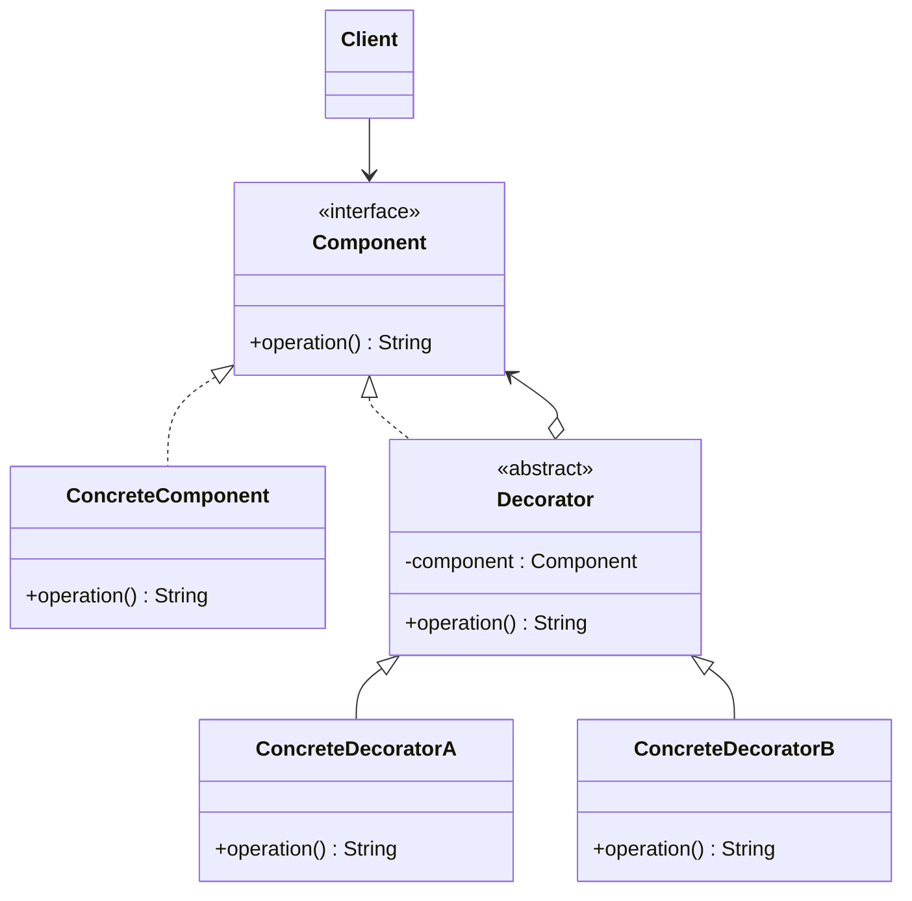

# 🍧 Decorator

*Structural pattern. Also known as* Wrapper.

## Intent

Attach additional responsibilities to an object dynamically. Decorators provide
a flexible alternative to subclassing for extending functionality [1, p. 175].

## Motivation

Adding a border or a scroll bar to any visual component through inheritance
would require one subclass per combination of component and feature, and the
choice would be fixed at compile time. Enclosing the component in another
object that conforms to the same interface, forwards every request to the
component and adds its own behaviour before or after, allows features to be
combined freely and chosen at run time. Because the decorator has the same
interface as what it wraps, it is transparent to clients and decorators can be
nested.

## Structure



## Participants

| Role [1] | Responsibility | Java | Python | TypeScript | JavaScript |
|---|---|---|---|---|---|
| Component | The interface shared by objects that can have responsibilities added: `operation()`. | [`Component`](../../java/src/main/java/com/penapereira/patterns/decorator/Component.java) | [`Component`](../../python/src/patterns/decorator/component.py) (Protocol) | [`Component`](../../typescript/src/decorator/component.ts) | implicit: any object with `operation()` ([`decorator/`](../../javascript/src/decorator/)) |
| ConcreteComponent | The object being decorated. | [`ConcreteComponent`](../../java/src/main/java/com/penapereira/patterns/decorator/ConcreteComponent.java) | `ConcreteComponent` | `ConcreteComponent` | `ConcreteComponent` |
| Decorator | Implements `Component`, holds the wrapped component and forwards to it by default. | [`Decorator`](../../java/src/main/java/com/penapereira/patterns/decorator/Decorator.java) | `Decorator` | `Decorator` | `Decorator` |
| ConcreteDecorator | Adds its responsibility around the delegated call. | [`ConcreteDecoratorA`](../../java/src/main/java/com/penapereira/patterns/decorator/ConcreteDecoratorA.java), `ConcreteDecoratorB` | `ConcreteDecoratorA`, `ConcreteDecoratorB` | `ConcreteDecoratorA`, `ConcreteDecoratorB` | `ConcreteDecoratorA`, `ConcreteDecoratorB` |
| Client | Uses decorated and undecorated objects alike through `Component`. | [`DecoratorExample`](../../java/src/main/java/com/penapereira/patterns/decorator/DecoratorExample.java) | `DecoratorExample` | [`decoratorExample`](../../typescript/src/decorator/example.ts) | [`decoratorExample`](../../javascript/src/decorator/example.js) |

## The example

The client wraps a `ConcreteComponent` in `ConcreteDecoratorA`, invokes
`operation()`, then wraps the result in `ConcreteDecoratorB` and invokes it
again. The nesting is visible in the output:

```
Executing Decorator Pattern Implementation
  ConcreteDecoratorA(ConcreteComponent)
  ConcreteDecoratorB(ConcreteDecoratorA(ConcreteComponent))
```

Run it with `make run P=decorator`.

## Consequences

* **More flexible than static inheritance.** Responsibilities are added and
  removed at run time, and the same decorator can be applied twice.
* **Avoids feature-laden classes high in the hierarchy.** Functionality is
  paid for only where it is used.
* **A decorator and its component are not identical.** Code that relies on
  object identity should not be given decorated objects.
* **Many small objects.** Systems built this way are easy to customise but can
  be hard to learn and debug.

## Language notes

* **Java.** The `java.io` streams are the standard example:
  `new BufferedInputStream(new FileInputStream(f))` decorates a byte source
  with buffering, and further wrappers add decompression or checksumming
  without changing the type the reader sees. `Collections.unmodifiableList`
  and `synchronizedList` are decorators as well. Bloch presents the forwarding
  class behind the pattern as the recommended alternative to inheritance
  across package boundaries [2, Item 18].
* **Python.** The `@decorator` syntax is the same idea applied to functions: a
  callable that wraps a callable and returns something with the same calling
  convention, `functools.wraps` preserving its identity metadata. Object
  decorators as shown here are rarer because `__getattr__` forwarding makes a
  generic wrapper trivial.
* **TypeScript.** Structural typing lets a decorator be any object with
  `operation()`; the class hierarchy is kept to mirror the diagram. TypeScript
  also has an experimental `@decorator` syntax for classes and members, which
  is metaprogramming rather than this pattern.
* **JavaScript.** Higher-order functions are the everyday decorator:
  `const logged = (f) => (...args) => { log(); return f(...args); }`. Object
  decorators as here are used when the wrapped thing has several methods.

## Related patterns

* **Adapter** changes an object's interface; Decorator keeps it and changes
  behaviour.
* **Composite**: a decorator is a degenerate composite with one child, but its
  purpose is augmentation rather than aggregation.
* **Strategy** changes the guts of an object; Decorator changes its skin.

## References

See [`references.md`](../references.md).

1. Gamma, Helm, Johnson and Vlissides, *Design Patterns*, pp. 175–184.
2. Bloch, *Effective Java*, 3rd ed., Item 18.
3. Freeman and Robson, *Head First Design Patterns*, 2nd ed., ch. 3.
