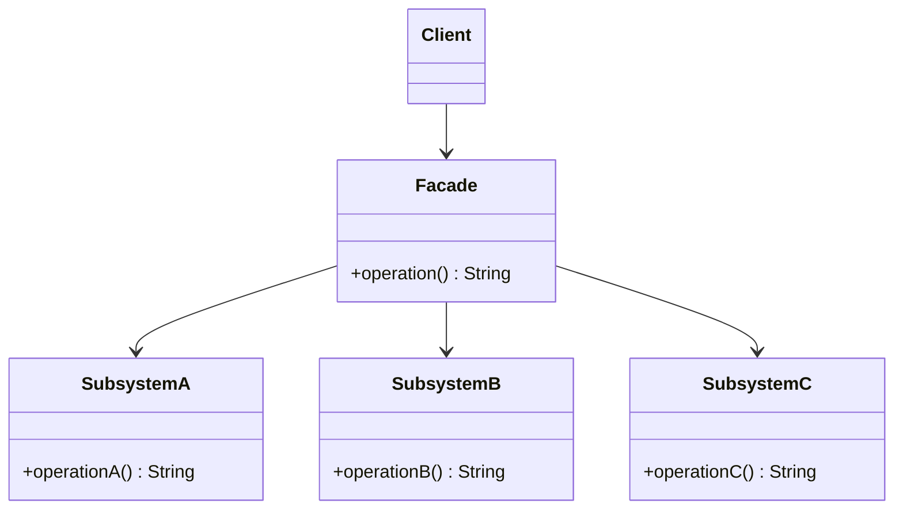

# 🎁 Façade

*Structural pattern.*

## Intent

Provide a unified interface to a set of interfaces in a subsystem. Façade
defines a higher-level interface that makes the subsystem easier to use
[1, p. 185].

## Motivation

A compiler subsystem contains a scanner, a parser, a symbol table, a code
generator and more. Most clients only want to compile a file; forcing them to
wire those classes together couples them to the subsystem's internals and
repeats the same sequence everywhere. A `Compiler` façade offers the one
operation most clients need and performs the sequence itself. Clients that
need finer control can still reach the subsystem classes directly.

## Structure



## Participants

| Role [1] | Responsibility | Java | Python | TypeScript | JavaScript |
|---|---|---|---|---|---|
| Facade | Knows which subsystem classes handle a request and delegates to them in the right order. | [`Facade`](../../java/src/main/java/com/penapereira/patterns/facade/Facade.java) | [`Facade`](../../python/src/patterns/facade/__init__.py) | [`Facade`](../../typescript/src/facade/facade.ts) | [`Facade`](../../javascript/src/facade/facade.js) |
| Subsystem classes | Implement the subsystem's functionality; know nothing of the façade. | [`SubsystemA`](../../java/src/main/java/com/penapereira/patterns/facade/SubsystemA.java), `SubsystemB`, `SubsystemC` | `SubsystemA`, `SubsystemB`, `SubsystemC` | `SubsystemA`, `SubsystemB`, `SubsystemC` | `SubsystemA`, `SubsystemB`, `SubsystemC` |
| Client | Talks to the façade only. | [`FacadeExample`](../../java/src/main/java/com/penapereira/patterns/facade/FacadeExample.java) | `FacadeExample` | [`facadeExample`](../../typescript/src/facade/example.ts) | [`facadeExample`](../../javascript/src/facade/example.js) |

## The example

The client makes one call on the façade, which drives the three subsystem
classes in order and reports what it did:

```
Executing Facade Pattern Implementation
  Facade.operation(): SubsystemA.operationA, SubsystemB.operationB, SubsystemC.operationC
```

Run it with `make run P=facade`.

## Consequences

* **Shields clients from subsystem components**, reducing the number of
  objects they deal with.
* **Promotes weak coupling** between the subsystem and its clients, so the
  subsystem can change without affecting them.
* **Does not prevent direct use** of the subsystem classes; the façade is a
  convenience, not a wall. The tests exercise both paths.
* A façade that grows to mirror the whole subsystem has stopped being a façade.

## Language notes

* **Java.** `javax.xml.parsers.DocumentBuilder.parse(File)` fronts a parser,
  an input source and error handling; `java.net.http.HttpClient.send` fronts
  connection management, request building and response decoding. A façade is
  often the only public class of a package, the rest being package-private.
* **Python.** A module's public functions frequently form a façade over
  classes the module keeps private (`json.dumps` over `JSONEncoder`,
  `subprocess.run` over `Popen`). The class here mirrors the diagram.
* **TypeScript.** A façade is commonly a module exporting a few functions
  over a set of internal classes; the class form is kept for the diagram.
  `fetch` is a façade over the networking stack.
* **JavaScript.** jQuery's `$` was the classic façade over the DOM and XHR
  APIs. The class here creates its subsystem objects itself, the usual case.

## Related patterns

* **Abstract Factory** can be used with Façade to create subsystem objects in
  a subsystem-independent way.
* **Mediator** also abstracts functionality of existing classes, but
  centralises communication among colleagues that know the mediator; subsystem
  classes know nothing of the façade.
* **Singleton**: usually only one façade object is required.
* **Adapter** changes one object's interface; Façade simplifies a whole
  subsystem's.

## References

See [`references.md`](../references.md).

1. Gamma, Helm, Johnson and Vlissides, *Design Patterns*, pp. 185–193.
3. Freeman and Robson, *Head First Design Patterns*, 2nd ed., ch. 7.
