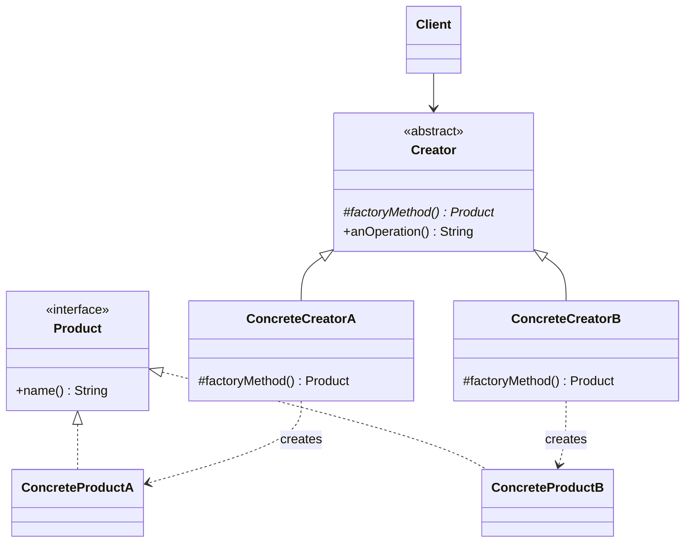

# 🏭 Factory Method

*Creational pattern. Also known as* Virtual Constructor.

## Intent

Define an interface for creating an object, but let subclasses decide which
class to instantiate. Factory Method lets a class defer instantiation to
subclasses [1, p. 107].

## Motivation

A framework often knows *when* an object must be created but not *which* class
it should be, because that class is application-specific. The framework class
therefore declares a creation operation, calls it at the appropriate point in
its own algorithms, and leaves its implementation to subclasses supplied by the
application. Gamma et al. remark that "Factory Methods are usually called
within Template Methods" [1, p. 116]; `anOperation()` below is exactly such a
template operation.

## Structure



## Participants

| Role [1] | Responsibility | Java | Python | TypeScript | JavaScript |
|---|---|---|---|---|---|
| Product | The interface of the objects the factory method creates: `name()`. | [`Product`](../../java/src/main/java/com/penapereira/patterns/factorymethod/Product.java) | [`Product`](../../python/src/patterns/factorymethod/product.py) (Protocol) | [`Product`](../../typescript/src/factory-method/product.ts) | implicit: any object with `name()` ([`factory-method/`](../../javascript/src/factory-method/)) |
| ConcreteProduct | Implements the Product interface. | [`ConcreteProductA`](../../java/src/main/java/com/penapereira/patterns/factorymethod/ConcreteProductA.java), `ConcreteProductB` | `ConcreteProductA`, `ConcreteProductB` | `ConcreteProductA`, `ConcreteProductB` | `ConcreteProductA`, `ConcreteProductB` |
| Creator | Declares the abstract `factoryMethod()` and calls it from `anOperation()`, its template operation. | [`Creator`](../../java/src/main/java/com/penapereira/patterns/factorymethod/Creator.java) | `Creator` (ABC, `factory_method`, `an_operation`) | `Creator` (abstract class) | `Creator` (base method throws) |
| ConcreteCreator | Overrides `factoryMethod()` to decide what is created. | [`ConcreteCreatorA`](../../java/src/main/java/com/penapereira/patterns/factorymethod/ConcreteCreatorA.java), `ConcreteCreatorB` | `ConcreteCreatorA`, `ConcreteCreatorB` | `ConcreteCreatorA`, `ConcreteCreatorB` | `ConcreteCreatorA`, `ConcreteCreatorB` |
| Client | Uses creators through the `Creator` type only. | [`FactoryMethodExample`](../../java/src/main/java/com/penapereira/patterns/factorymethod/FactoryMethodExample.java) | `FactoryMethodExample` | [`factoryMethodExample`](../../typescript/src/factory-method/example.ts) | [`factoryMethodExample`](../../javascript/src/factory-method/example.js) |

## The example

The client holds both concrete creators through the `Creator` type and calls
`anOperation()` on each. The base class reports what the subclass decided to
produce:

```
Executing Factory Method Pattern Implementation
  Built ConcreteProductA
  Built ConcreteProductB
```

Run it with `make run P=factory-method`.

## Consequences

* **Eliminates the need to bind application-specific classes into framework
  code.** The base class works with whatever the subclass returns.
* **Provides hooks for subclasses.** A factory method is a natural extension
  point.
* **Connects parallel class hierarchies**, letting a creator hierarchy mirror a
  product hierarchy.
* **Clients may have to subclass just to create a product**, which is the
  pattern's main drawback when the creator hierarchy does not already exist.

## Language notes

* **Java.** `Iterable.iterator()` is the most pervasive factory method: every
  collection decides which `Iterator` implementation to instantiate, and
  clients never name it. Bloch's *static factory method* [2, Item 1] is a
  different technique despite the similar name: a static method with no
  subclassing involved, closer to the Simple Factory in this collection.
  `factoryMethod()` is `protected abstract`, so the compiler enforces the
  override.
* **Python.** `Creator` derives from `abc.ABC` and marks `factory_method` with
  `@abstractmethod`; a subclass that forgets it cannot even be instantiated.
  In practice Python code often replaces the whole creator hierarchy with a
  class passed as a parameter, since classes are callables.
* **TypeScript.** `abstract class Creator` with `protected abstract
  factoryMethod()`; the compiler rejects an incomplete subclass.
* **JavaScript.** There are no abstract methods. The base `factoryMethod()`
  throws, so forgetting the override fails at the first call rather than at
  definition time. This is the idiomatic substitute and is covered by a test.

## Related patterns

* **Template Method**: the operation that calls the factory method is
  typically a template method, as `anOperation()` is here.
* **Abstract Factory**: often implemented with factory methods.
* **Prototype**: avoids subclassing the creator by cloning a prototype instead.

## References

See [`references.md`](../references.md).

1. Gamma, Helm, Johnson and Vlissides, *Design Patterns*, pp. 107–116.
2. Bloch, *Effective Java*, 3rd ed., Item 1.
3. Freeman and Robson, *Head First Design Patterns*, 2nd ed., ch. 4.
