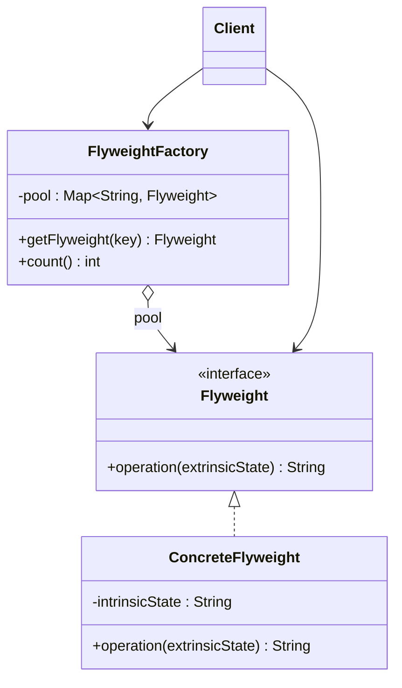

# 🍃 Flyweight

*Structural pattern.*

## Intent

Use sharing to support large numbers of fine-grained objects efficiently
[1, p. 195].

*Principles:* [Encapsulate what varies](../principles.md#encapsulate-what-varies).

## Motivation

A document editor that represents every character as an object pays for
hundreds of thousands of objects, most of them identical: every `a` in a
12-point font has the same glyph outline. Flyweight splits the object's state
in two. *Intrinsic* state, the part that is context-independent (the
character code, the outline), lives in a shared flyweight object; *extrinsic*
state, the part that varies with context (position, style run), is kept by the
client and passed in when an operation is invoked. A factory hands out the
shared objects, so an `a` is created once and used everywhere.

## Structure



## Participants

| Role [1] | Responsibility | Java | Python | TypeScript | JavaScript |
|---|---|---|---|---|---|
| Flyweight | The interface through which flyweights receive and act on extrinsic state. | [`Flyweight`](../../java/src/main/java/com/penapereira/patterns/flyweight/Flyweight.java) | [`Flyweight`](../../python/src/patterns/flyweight/flyweight.py) (Protocol) | [`Flyweight`](../../typescript/src/flyweight/flyweight.ts) | implicit: any object with `operation()` |
| ConcreteFlyweight | Stores intrinsic state; sharable. | [`ConcreteFlyweight`](../../java/src/main/java/com/penapereira/patterns/flyweight/ConcreteFlyweight.java) | [`ConcreteFlyweight`](../../python/src/patterns/flyweight/concrete_flyweight.py) | [`ConcreteFlyweight`](../../typescript/src/flyweight/concrete-flyweight.ts) | [`ConcreteFlyweight`](../../javascript/src/flyweight/concrete-flyweight.js) |
| FlyweightFactory | Creates and manages flyweights; returns an existing one when it has it. | [`FlyweightFactory`](../../java/src/main/java/com/penapereira/patterns/flyweight/FlyweightFactory.java) | [`FlyweightFactory`](../../python/src/patterns/flyweight/flyweight_factory.py) (`get_flyweight`, `count`) | [`FlyweightFactory`](../../typescript/src/flyweight/flyweight-factory.ts) | [`FlyweightFactory`](../../javascript/src/flyweight/flyweight-factory.js) |
| Client | Holds the extrinsic state and obtains flyweights from the factory only. | [`FlyweightExample`](../../java/src/main/java/com/penapereira/patterns/flyweight/FlyweightExample.java) | [`FlyweightExample`](../../python/src/patterns/flyweight/example.py) | [`flyweightExample`](../../typescript/src/flyweight/example.ts) | [`flyweightExample`](../../javascript/src/flyweight/example.js) |

Gamma et al. also list *UnsharedConcreteFlyweight* for objects in the
hierarchy that are not shared (a row or column in the text example). It is
omitted here to keep the structure minimal.
## The example

The client asks the factory for the flyweights `a`, `b` and `a` in turn,
passing a different extrinsic state each time. The third request returns the
object created by the first, so three requests produce two objects:

```
Executing Flyweight Pattern Implementation
  ConcreteFlyweight(a) with extrinsic state 1
  ConcreteFlyweight(b) with extrinsic state 2
  ConcreteFlyweight(a) with extrinsic state 3
  Flyweights created: 2 for 3 requests
```

Run it with `make run P=flyweight`.

## Consequences

* **Storage savings** proportional to how much state can be made intrinsic and
  how many objects share it.
* **Run-time cost** of transferring, finding or computing extrinsic state on
  every operation.
* **Identity becomes meaningless** for shared flyweights: two conceptually
  distinct characters may be one object, so nothing may depend on it.
* Flyweights must be **immutable** with respect to intrinsic state, or sharing
  breaks.

## Language notes

* **Java.** `Integer.valueOf` caches small integers, `String` literals are
  interned, and `Boolean.TRUE`/`FALSE` are the smallest flyweight pool;
  `enum` constants are flyweights by construction. Bloch's advice to avoid
  creating unnecessary objects [2, Item 6] is the pattern's motivation.
  `computeIfAbsent` is the idiomatic get-or-create.
* **Python.** Small integers and interned strings are flyweights maintained by
  the interpreter; `functools.lru_cache` on a factory function is a one-line
  flyweight factory. `__slots__` reduces per-instance cost when sharing is
  not possible.
* **TypeScript.** A `Map<string, Flyweight>` pool; string literals are already
  shared by the engine. Immutability can be expressed with `readonly`.
* **JavaScript.** Same as TypeScript. Frameworks that key reusable DOM nodes
  or memoise components are applying the idea at a larger grain.

## Related patterns

* **Composite**: flyweights are often combined with Composite to build a
  logically hierarchical structure over shared leaves.
* **State** and **Strategy** objects are frequently implemented as flyweights
  when they carry no per-context state.
* **Singleton**: a factory that hands out one shared object per key generalises
  the single-instance idea.

## References

See [`references.md`](../references.md).

1. Gamma, Helm, Johnson and Vlissides, *Design Patterns*, pp. 195–206.
2. Bloch, *Effective Java*, 3rd ed., Item 6.
