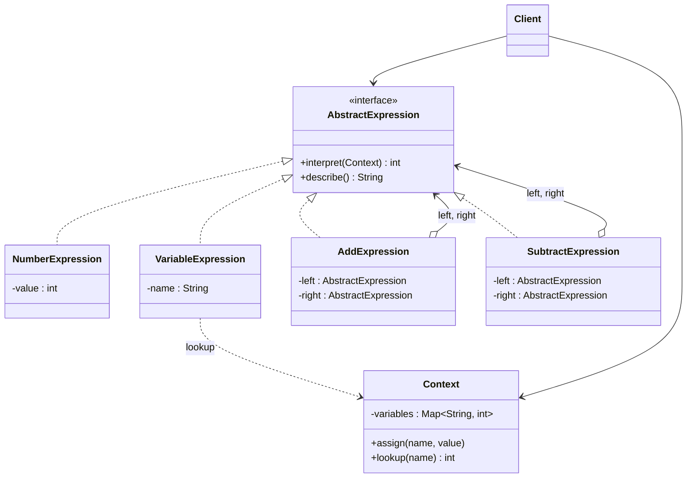

# 🎶 Interpreter

*Behavioural pattern.*

## Intent

Given a language, define a representation for its grammar along with an
interpreter that uses the representation to interpret sentences in the
language [1, p. 243].

*Principles:* [Program to an interface](../principles.md#program-to-an-interface), [Open-closed principle](../principles.md#open-closed-principle).

## Motivation

When a problem recurs often enough, it pays to express its instances as
sentences in a small language and to build an interpreter for that language:
regular expressions for string matching, arithmetic over variables for
spreadsheet cells. The pattern represents each grammar rule as a class. A
sentence becomes a tree of those objects, an *abstract syntax tree*, and
interpreting the sentence is a recursive `interpret` call over the tree, each
node interpreting its children and combining the results. Building the tree
(parsing) is deliberately outside the pattern.

The grammar interpreted here:

```
expression ::= number | variable | expression '+' expression | expression '-' expression
```

## Structure



## Participants

| Role [1] | Responsibility | Java | Python | TypeScript | JavaScript |
|---|---|---|---|---|---|
| AbstractExpression | Declares `interpret(context)` common to all nodes of the syntax tree. | [`AbstractExpression`](../../java/src/main/java/com/penapereira/patterns/interpreter/AbstractExpression.java) | [`AbstractExpression`](../../python/src/patterns/interpreter/abstract_expression.py) (Protocol) | [`AbstractExpression`](../../typescript/src/interpreter/abstract-expression.ts) | implicit: any object with `interpret` and `describe` |
| TerminalExpression | Interprets a terminal symbol of the grammar: a literal or a variable. | [`NumberExpression`](../../java/src/main/java/com/penapereira/patterns/interpreter/NumberExpression.java), [`VariableExpression`](../../java/src/main/java/com/penapereira/patterns/interpreter/VariableExpression.java) | [`NumberExpression`](../../python/src/patterns/interpreter/number_expression.py), [`VariableExpression`](../../python/src/patterns/interpreter/variable_expression.py) | [`NumberExpression`](../../typescript/src/interpreter/number-expression.ts), [`VariableExpression`](../../typescript/src/interpreter/variable-expression.ts) | [`NumberExpression`](../../javascript/src/interpreter/number-expression.js), [`VariableExpression`](../../javascript/src/interpreter/variable-expression.js) |
| NonterminalExpression | One class per grammar rule; holds sub-expressions and interprets recursively. | [`AddExpression`](../../java/src/main/java/com/penapereira/patterns/interpreter/AddExpression.java), [`SubtractExpression`](../../java/src/main/java/com/penapereira/patterns/interpreter/SubtractExpression.java) | [`AddExpression`](../../python/src/patterns/interpreter/add_expression.py), [`SubtractExpression`](../../python/src/patterns/interpreter/subtract_expression.py) | [`AddExpression`](../../typescript/src/interpreter/add-expression.ts), [`SubtractExpression`](../../typescript/src/interpreter/subtract-expression.ts) | [`AddExpression`](../../javascript/src/interpreter/add-expression.js), [`SubtractExpression`](../../javascript/src/interpreter/subtract-expression.js) |
| Context | Information global to the interpreter: the variable bindings. | [`Context`](../../java/src/main/java/com/penapereira/patterns/interpreter/Context.java) | [`Context`](../../python/src/patterns/interpreter/context.py) | [`Context`](../../typescript/src/interpreter/context.ts) | [`Context`](../../javascript/src/interpreter/context.js) |
| Client | Builds the syntax tree and invokes `interpret`. | [`InterpreterExample`](../../java/src/main/java/com/penapereira/patterns/interpreter/InterpreterExample.java) | [`InterpreterExample`](../../python/src/patterns/interpreter/example.py) | [`interpreterExample`](../../typescript/src/interpreter/example.ts) | [`interpreterExample`](../../javascript/src/interpreter/example.js) |
## The example

The client builds the tree for `((x + 3) - y)` by hand and interprets it under
two different contexts:

```
Executing Interpreter Pattern Implementation
  Expression: ((x + 3) - y)
  With x = 5, y = 2: 6
  With x = 10, y = 0: 13
```

Run it with `make run P=interpreter`.

## Consequences

* **The grammar is easy to change and extend**: a new rule is a new class,
  and existing classes are unaffected.
* **Implementing the grammar is easy**: each class is small and regular.
* **Complex grammars are hard to maintain**: one class per rule does not
  scale to large languages; parser generators are the tool then.
* **Adding new ways of interpreting** (pretty printing, type checking) means
  touching every class unless the operations are moved into Visitors.

## Language notes

* **Java.** `java.util.regex.Pattern` compiles a regular expression into an
  interpretable node tree; Spring Expression Language and JEXL are full
  interpreters of this shape. With `sealed` interfaces and records the
  expression classes become one-liners and `switch` pattern matching can
  replace `interpret` methods.
* **Python.** The `ast` module and `compile`/`eval` are the language's own
  interpreter exposed; for small DSLs, classes with `__call__` or plain nested
  tuples interpreted by one recursive function are common. `operator.add`
  and friends replace tiny nonterminal classes.
* **TypeScript.** Expression trees are naturally discriminated unions
  evaluated by one recursive function; the class-per-rule form shown keeps
  each rule's `interpret` next to its data. Template-literal types can even
  parse small grammars at compile time.
* **JavaScript.** Template engines, JSONPath and query builders are
  interpreters over small ASTs; `new Function` is the escape hatch that makes
  hand-written interpreters rare for arithmetic.

## Related patterns

* **Composite**: the abstract syntax tree is a composite of expressions.
* **Flyweight**: terminal symbols shared across sentences can be flyweights.
* **Iterator**: traverses the tree.
* **Visitor**: keeps interpretation, printing and other operations out of the
  node classes.

## References

See [`references.md`](../references.md).

1. Gamma, Helm, Johnson and Vlissides, *Design Patterns*, pp. 243–255.
