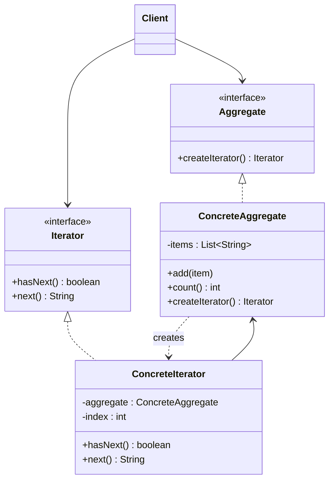

# 🍫 Iterator

*Behavioural pattern. Also known as* Cursor.

## Intent

Provide a way to access the elements of an aggregate object sequentially
without exposing its underlying representation [1, p. 257].

*Principles:* [Single responsibility principle](../principles.md#single-responsibility-principle), [Program to an interface](../principles.md#program-to-an-interface), [Encapsulate what varies](../principles.md#encapsulate-what-varies).

## Motivation

A list should let clients visit its elements without revealing whether it is
an array, a linked structure or a tree, and it should allow several traversals
to be in progress at once, possibly with different policies. Putting the
traversal in the list's interface bloats it; putting it in the client couples
the client to the representation. Iterator moves the traversal into a separate
object that knows the aggregate's internals and tracks its own position. The
aggregate offers only a factory method that hands out iterators.

## Structure



## Participants

| Role [1] | Responsibility | Java | Python | TypeScript | JavaScript |
|---|---|---|---|---|---|
| Iterator | The interface for accessing and traversing elements: `hasNext()`, `next()`. | [`Iterator`](../../java/src/main/java/com/penapereira/patterns/iterator/Iterator.java) | [`Iterator`](../../python/src/patterns/iterator/iterator.py) (Protocol, `has_next`, `next`) | [`Iterator`](../../typescript/src/iterator/iterator.ts) | implicit: any object with `hasNext` and `next` |
| ConcreteIterator | Keeps track of the current position in the traversal. | [`ConcreteIterator`](../../java/src/main/java/com/penapereira/patterns/iterator/ConcreteIterator.java) | [`ConcreteIterator`](../../python/src/patterns/iterator/concrete_iterator.py) | [`ConcreteIterator`](../../typescript/src/iterator/concrete-iterator.ts) | [`ConcreteIterator`](../../javascript/src/iterator/concrete-iterator.js) |
| Aggregate | The interface for creating an Iterator object. | [`Aggregate`](../../java/src/main/java/com/penapereira/patterns/iterator/Aggregate.java) | [`Aggregate`](../../python/src/patterns/iterator/aggregate.py) (Protocol, `create_iterator`) | [`Aggregate`](../../typescript/src/iterator/aggregate.ts) | implicit: any object with `createIterator` |
| ConcreteAggregate | Implements the creation interface to return the matching iterator. | [`ConcreteAggregate`](../../java/src/main/java/com/penapereira/patterns/iterator/ConcreteAggregate.java) | [`ConcreteAggregate`](../../python/src/patterns/iterator/concrete_aggregate.py) | [`ConcreteAggregate`](../../typescript/src/iterator/concrete-aggregate.ts) | [`ConcreteAggregate`](../../javascript/src/iterator/concrete-aggregate.js) |
| Client | Traverses through the Iterator interface only. | [`IteratorExample`](../../java/src/main/java/com/penapereira/patterns/iterator/IteratorExample.java) | [`IteratorExample`](../../python/src/patterns/iterator/example.py) | [`iteratorExample`](../../typescript/src/iterator/example.ts) | [`iteratorExample`](../../javascript/src/iterator/example.js) |
## The example

The client fills an aggregate, traverses it with an iterator, then creates two
more iterators and shows they advance independently:

```
Executing Iterator Pattern Implementation
  ConcreteIterator traversal: a b c
  Two iterators are independent: first.next()=a, second.next()=a
```

Run it with `make run P=iterator`.

## Consequences

* **Supports variations in the traversal** (forward, backward, filtered) by
  supplying different iterators for one aggregate.
* **Simplifies the aggregate's interface**: traversal is not its concern.
* **More than one traversal can be pending** on the same aggregate, each
  iterator keeping its own state.
* An *external* iterator (this one, driven by the client) is more flexible
  than an *internal* one (the aggregate applies a function to every element)
  but more work to use. Modifying the aggregate during traversal is a hazard
  every iterator design must address.

## Language notes

* **Java.** `java.util.Iterator` and `Iterable` are this pattern built into
  the language: `for (x : coll)` calls `iterator()` (the Aggregate's factory
  method) and then `hasNext()`/`next()`. Collections throw
  `ConcurrentModificationException` when modified mid-traversal (fail-fast).
  `Stream` is the internal-iterator counterpart.
* **Python.** The iterator protocol is `__iter__` (Aggregate.createIterator)
  and `__next__` raising `StopIteration` (the end signal instead of
  `hasNext`); generators write iterators as functions with `yield`. The
  explicit classes here mirror the diagram; `ConcreteIterator.next` raises
  `StopIteration` at the end to stay idiomatic.
* **TypeScript.** `Symbol.iterator` returning `{ next(): { value, done } }` is
  the protocol behind `for...of` and spread; generator functions produce it.
  The GoF split of `hasNext`/`next` maps onto the single `next()` returning
  `done`.
* **JavaScript.** Same protocol; `Array`, `Map`, `Set` and strings are
  aggregates whose `[Symbol.iterator]()` is `createIterator()`.

## Related patterns

* **Composite**: iterators are often applied to recursive structures.
* **Factory Method**: `createIterator()` is one; polymorphic iterators rely on
  it.
* **Memento**: an iterator can use a memento to capture the traversal state.

## References

See [`references.md`](../references.md).

1. Gamma, Helm, Johnson and Vlissides, *Design Patterns*, pp. 257–271.
3. Freeman and Robson, *Head First Design Patterns*, 2nd ed., ch. 9.
