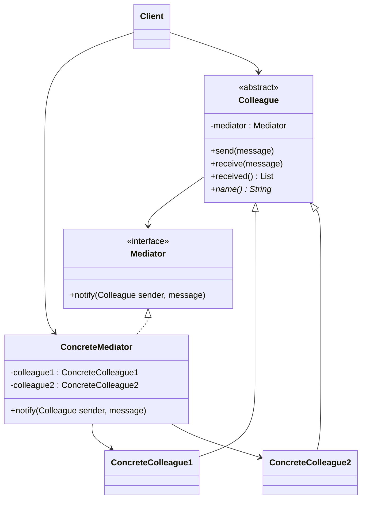

# 💐 Mediator

*Behavioural pattern.*

## Intent

Define an object that encapsulates how a set of objects interact. Mediator
promotes loose coupling by keeping objects from referring to each other
explicitly, and it lets you vary their interaction independently [1, p. 273].

## Motivation

The widgets of a dialog box depend on one another: choosing an entry in a list
fills a text field, typing in the field enables a button, a check box disables
a group of radio buttons. If every widget knows every widget it affects, the
dialog's behaviour is scattered over many classes and no widget is reusable
outside this dialog. A mediator, one object per dialog, holds all of that
knowledge. Widgets tell the mediator when something happens and the mediator
tells the other widgets what to do; the widgets know only the mediator.

## Structure



## Participants

| Role [1] | Responsibility | Java | Python | TypeScript | JavaScript |
|---|---|---|---|---|---|
| Mediator | Defines the interface for communicating with colleagues. | [`Mediator`](../../java/src/main/java/com/penapereira/patterns/mediator/Mediator.java) | [`Mediator`](../../python/src/patterns/mediator/mediator.py) (Protocol) | [`Mediator`](../../typescript/src/mediator/mediator.ts) | implicit: any object with `notify` |
| ConcreteMediator | Knows and maintains its colleagues; implements the cooperative behaviour by routing. | [`ConcreteMediator`](../../java/src/main/java/com/penapereira/patterns/mediator/ConcreteMediator.java) | [`ConcreteMediator`](../../python/src/patterns/mediator/concrete_mediator.py) | [`ConcreteMediator`](../../typescript/src/mediator/concrete-mediator.ts) | [`ConcreteMediator`](../../javascript/src/mediator/concrete-mediator.js) |
| Colleague | Knows its mediator and communicates with it, never with other colleagues. | [`Colleague`](../../java/src/main/java/com/penapereira/patterns/mediator/Colleague.java) | [`Colleague`](../../python/src/patterns/mediator/colleague.py) | [`Colleague`](../../typescript/src/mediator/colleague.ts) | [`Colleague`](../../javascript/src/mediator/colleague.js) |
| ConcreteColleague | A specific colleague; here two that only differ by name. | [`ConcreteColleague1`](../../java/src/main/java/com/penapereira/patterns/mediator/ConcreteColleague1.java), [`ConcreteColleague2`](../../java/src/main/java/com/penapereira/patterns/mediator/ConcreteColleague2.java) | [`ConcreteColleague1`](../../python/src/patterns/mediator/concrete_colleague1.py), [`ConcreteColleague2`](../../python/src/patterns/mediator/concrete_colleague2.py) | [`ConcreteColleague1`](../../typescript/src/mediator/concrete-colleague1.ts), [`ConcreteColleague2`](../../typescript/src/mediator/concrete-colleague2.ts) | [`ConcreteColleague1`](../../javascript/src/mediator/concrete-colleague1.js), [`ConcreteColleague2`](../../javascript/src/mediator/concrete-colleague2.js) |
| Client | Wires colleagues to the mediator and triggers messages. | [`MediatorExample`](../../java/src/main/java/com/penapereira/patterns/mediator/MediatorExample.java) | [`MediatorExample`](../../python/src/patterns/mediator/example.py) | [`mediatorExample`](../../typescript/src/mediator/example.ts) | [`mediatorExample`](../../javascript/src/mediator/example.js) |
## The example

Two colleagues are wired to one mediator. Each sends a message; the mediator
delivers it to the other. Neither colleague holds a reference to the other:

```
Executing Mediator Pattern Implementation
  ConcreteColleague1 sends: hello
  ConcreteColleague2 receives: hello
  ConcreteColleague2 sends: hi
  ConcreteColleague1 receives: hi
```

Run it with `make run P=mediator`.

## Consequences

* **Limits subclassing**: changing the interaction means changing the
  mediator, not the colleagues.
* **Decouples colleagues**, which can be reused in other contexts with other
  mediators.
* **Simplifies object protocols**: many-to-many interactions become
  one-to-many between mediator and colleagues.
* **Centralises control**, and the mediator can grow into a monolith that is
  hard to maintain, the pattern's main risk.

## Language notes

* **Java.** Swing dialogs typically use the enclosing panel as the mediator
  for their widgets; `java.util.concurrent.Executor` mediates between task
  producers and worker threads. Message brokers and event buses are mediators
  at system scale.
* **Python.** A mediator is often a plain object with methods that the
  colleagues call, or an event-dispatch dict; the class form is kept for the
  diagram. `asyncio` event loops mediate between coroutines.
* **TypeScript.** Front-end state containers (a store) mediate between
  components that never import one another; the `notify(sender, message)` shape
  is exactly an action being dispatched.
* **JavaScript.** `EventTarget` used as a shared bus is a mediator with no
  knowledge of its colleagues; the explicit `ConcreteMediator` here knows them,
  which is what lets it encode the interaction rules.

## Related patterns

* **Façade** abstracts a subsystem one-directionally for clients; a mediator
  enables cooperative, bidirectional behaviour among colleagues that know it.
* **Observer**: colleagues often communicate with the mediator through
  Observer, the mediator being the observer of all of them.

## References

See [`references.md`](../references.md).

1. Gamma, Helm, Johnson and Vlissides, *Design Patterns*, pp. 273–282.
