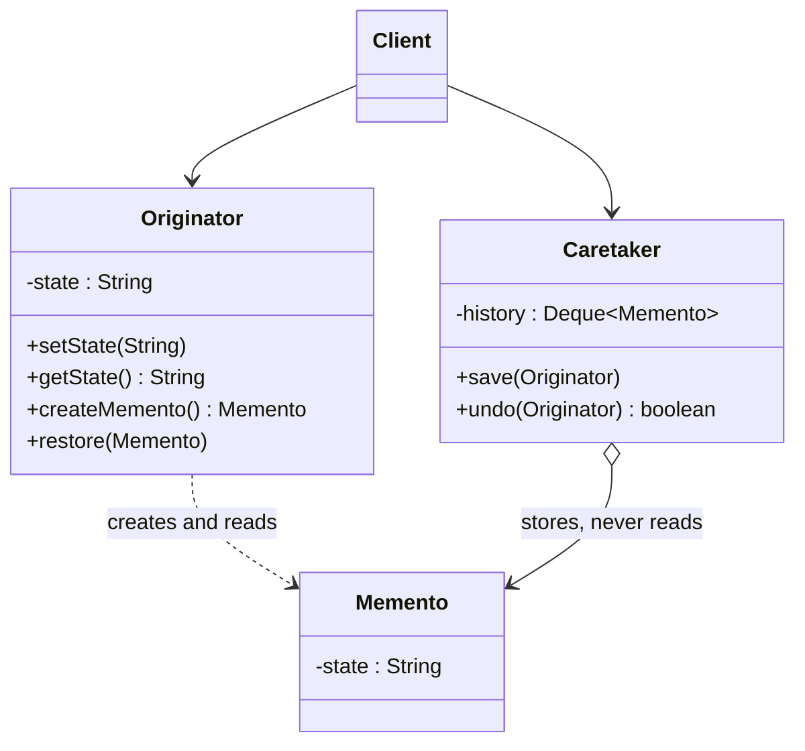

# 💾 Memento

*Behavioural pattern. Also known as* Token.

## Intent

Without violating encapsulation, capture and externalize an object's internal
state so that the object can be restored to this state later [1, p. 283].

## Motivation

An undo mechanism must save an object's state before an operation so the state
can be put back. Exposing the state through public accessors would let any
client depend on the object's internals. Memento keeps the encapsulation: the
*originator* itself creates a snapshot object, the *memento*, whose contents
only the originator can read; a *caretaker* stores mementos and hands them back
without ever looking inside. The originator restores itself from a memento it
receives.

## Structure



## Participants

| Role [1] | Responsibility | Java | Python | TypeScript | JavaScript |
|---|---|---|---|---|---|
| Originator | Creates a memento of its current internal state and uses one to restore it. | [`Originator`](../../java/src/main/java/com/penapereira/patterns/memento/Originator.java) | [`Originator`](../../python/src/patterns/memento/originator.py) (`create_memento`, `restore`) | [`Originator`](../../typescript/src/memento/originator.ts) | [`Originator`](../../javascript/src/memento/memento.js) |
| Memento | Stores the originator's state; wide interface for the originator, narrow (opaque) for everyone else. | `Originator.Memento` (nested, private field) | `Memento` (`_state` convention) | `Memento` (opaque interface) + `ConcreteMemento`, imported only by the originator | `Memento` (`#state`, getter used only by the originator) |
| Caretaker | Keeps mementos safe; never operates on or examines their contents. | [`Caretaker`](../../java/src/main/java/com/penapereira/patterns/memento/Caretaker.java) | `Caretaker` | `Caretaker` | `Caretaker` |
| Client | Drives changes and asks the caretaker to save and undo. | [`MementoExample`](../../java/src/main/java/com/penapereira/patterns/memento/MementoExample.java) | `MementoExample` | [`mementoExample`](../../typescript/src/memento/example.ts) | [`mementoExample`](../../javascript/src/memento/example.js) |

Gamma et al. stress the two interfaces [1, p. 285]: the caretaker sees a
*narrow* interface (it can only pass the memento around), the originator a
*wide* one (it reads the state back). How strictly a language can enforce that
split is the substance of the Language notes below.

## The example

The client changes the originator's state three times, saving after the first
two, then undoes twice through the caretaker:

```
Executing Memento Pattern Implementation
  Originator state: A (saved)
  Originator state: B (saved)
  Originator state: C
  Restored: B
  Restored: A
```

Run it with `make run P=memento`.

## Consequences

* **Preserves encapsulation boundaries**: state that would otherwise need to be
  exposed for undo stays private to the originator.
* **Simplifies the originator**, which need not keep versions of its own state.
* **Mementos may be expensive** if the state is large; incremental mementos
  (storing only the change) are the usual mitigation.
* **The caretaker cannot know the cost** of the mementos it stores, and a
  language without friend access may need to trade some encapsulation for the
  two-interface split.

## Language notes

* **Java.** A nested `static class Memento` inside `Originator` with a
  `private final` field gives the textbook split for free: the outer class may
  read nested private members, nobody else can. `java.io.Serializable`
  snapshots and `javax.swing.undo.UndoableEdit` are mementos in the platform.
* **Python.** There is no access control; `_state` is a convention and the
  caretaker simply does not read it. `copy.deepcopy` of the originator's
  `__dict__` or `pickle` are the usual snapshot mechanisms; `dataclasses`
  with `frozen=True` make good immutable mementos.
* **TypeScript.** The wide/narrow split is expressed in the type system: the
  exported `Memento` is an empty interface, the class holding the state is not
  exported, and `Originator.restore` narrows with `instanceof`. Structural
  typing means any object satisfies an empty interface, so the check is needed.
* **JavaScript.** `#state` keeps the field private to the `Memento` class
  itself, so the originator reads it through a getter; the caretaker's
  discipline is not enforceable. Immutable snapshots via `Object.freeze` are
  the everyday form.

## Related patterns

* **Command** uses mementos to keep the state a command needs for undo.
* **Iterator** can use a memento to capture the state of a traversal.

## References

See [`references.md`](../references.md).

1. Gamma, Helm, Johnson and Vlissides, *Design Patterns*, pp. 283–291.
