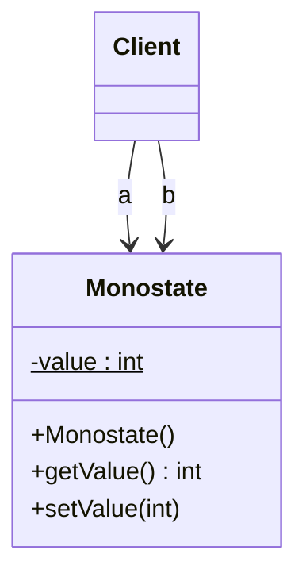

# 🔂 Monostate

*Creational pattern. Also known as* Borg *(Python).*

## Intent

Share all state among every instance of a class while leaving instantiation
unconstrained, so that clients get singleton-like behaviour through ordinary
objects [7], [8].

## Motivation

Singleton guarantees one *instance* and forces every client to reach it
through a static access point, which couples the client to the fact that the
object is unique. Often what is really required is one *state*: every part of
the program must see the same configuration, the same counter, the same
connection. Monostate achieves that by making all the class's fields static
while its methods stay ordinary instance methods. Clients construct instances
freely, pass them around, mock them, and never learn that two instances are
"the same"; the uniqueness is an implementation detail of the class, not a
constraint on its users [8].

## Structure



## Participants

| Role | Responsibility | Java | Python | TypeScript | JavaScript |
|---|---|---|---|---|---|
| Monostate | Public constructor; all state in class-level fields; instance accessors read and write that shared state. | [`Monostate`](../../java/src/main/java/com/penapereira/patterns/monostate/Monostate.java) | [`Monostate`](../../python/src/patterns/monostate/monostate.py) (`get_value`, `set_value`) | [`Monostate`](../../typescript/src/monostate/monostate.ts) | [`Monostate`](../../javascript/src/monostate/monostate.js) |
| Client | Creates as many instances as it likes and uses them like any object. | [`MonostateExample`](../../java/src/main/java/com/penapereira/patterns/monostate/MonostateExample.java) | [`MonostateExample`](../../python/src/patterns/monostate/example.py) | [`monostateExample`](../../typescript/src/monostate/example.ts) | [`monostateExample`](../../javascript/src/monostate/example.js) |
## The example

The client creates two instances, shows they are different objects, writes
through one and reads through the other in both directions:

```
Executing Monostate Pattern Implementation
  Two instances are distinct objects: true
  a.setValue(42) then b.getValue(): 42
  b.setValue(7) then a.getValue(): 7
```

Run it with `make run P=monostate`.

## Consequences

* **Transparency.** Clients cannot tell a monostate from an ordinary class;
  no static access point, no `instance()`.
* **Derivability and polymorphism.** Subclasses share the base state yet may
  override behaviour, which Singleton makes awkward.
* **Well-defined creation and destruction**: instances come and go like any
  other; the state lives as long as the class.
* **Hidden global state**, exactly as with Singleton: tests must set known
  values rather than assume a fresh start, and threads need synchronisation.
* **Cost.** Every instance still allocates an object, and the shared state
  cannot be released while the class is loaded.

## Language notes

* **Java.** `private static` fields plus non-static accessors; the compiler
  enforces nothing about it, so the intent must be documented. Class
  initialisation gives the initial value once and safely, but later writes need
  `volatile` or locks under threads. Martin presents Monostate alongside
  Singleton and prefers it when uniqueness should be transparent [8].
* **Python.** Class attributes are shared, but `self._value = v` would create
  an *instance* attribute that shadows them; the setter therefore writes
  through `type(self)`. The Python community's *Borg* idiom instead points
  every instance's `__dict__` at one shared dictionary in `__new__`, so all
  attribute assignments are shared automatically.
* **TypeScript.** `private static value` with instance `getValue`/`setValue`;
  the type system does not distinguish a monostate from a normal class, which
  is the point.
* **JavaScript.** `static #value` keeps the shared state private to the class;
  module-level state captured by a class is an equivalent formulation, since
  ES modules are evaluated once.

## Related patterns

* **Singleton**: uniqueness of *instance* enforced on clients; Monostate is
  uniqueness of *state* hidden from them. Choose Monostate when clients should
  stay unaware.
* **Flyweight**: also shares state, but per key, and keeps extrinsic state
  outside the shared object.

## References

See [`references.md`](../references.md).

7. Ball and Crawford, "Monostate Classes: The Power of One," *C++ Report*, 1997.
8. Martin, *Agile Software Development*, ch. on Singleton and Monostate.
