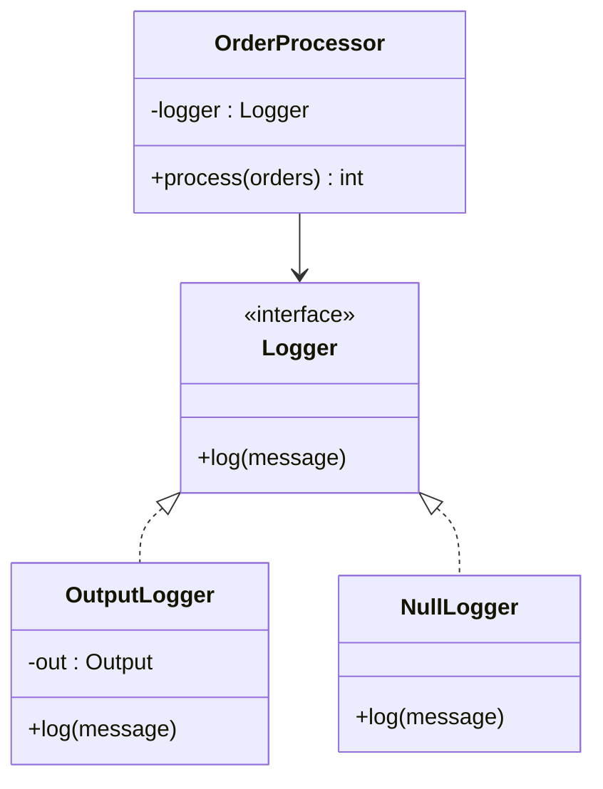

# 🫥 Null Object

*Behavioural pattern.*

## Intent

Provide a do-nothing collaborator with the expected interface, so that clients
use it exactly as they would a real one and never test for null [19; 8, ch.
17].

*Principles:* [Program to an interface](../principles.md#program-to-an-interface), [Liskov substitution principle](../principles.md#liskov-substitution-principle).

## Motivation

A service that may or may not have a logger, a customer that may or may not
exist, a strategy that may or may not be configured: whenever "absent" is
represented by a null reference, every client has to guard every use with a
test, and the first client that forgets crashes at run time. Woolf's Null
Object replaces the null reference with an object that implements the same
interface and does nothing (or returns a harmless neutral value) [19]. The
client code loses its conditionals; the "absence" behaviour is defined once,
in the null object, instead of being repeated at every call site. Fowler
generalises it as *Special Case*: an object that provides the behaviour for a
particular case, of which "nothing" is the most common [18, p. 496].

## Structure



## Participants

| Role [19] | Responsibility | Java | Python | TypeScript | JavaScript |
|---|---|---|---|---|---|
| AbstractObject | The interface the client depends on. | [`Logger`](../../java/src/main/java/com/penapereira/patterns/nullobject/Logger.java) | [`Logger`](../../python/src/patterns/nullobject/logger.py) | `Logger` | implicit: any object with `log()` |
| RealObject | The useful implementation. | [`OutputLogger`](../../java/src/main/java/com/penapereira/patterns/nullobject/OutputLogger.java) | [`OutputLogger`](../../python/src/patterns/nullobject/output_logger.py) | `OutputLogger` | `OutputLogger` |
| NullObject | Implements the interface and does nothing. | [`NullLogger`](../../java/src/main/java/com/penapereira/patterns/nullobject/NullLogger.java) | [`NullLogger`](../../python/src/patterns/nullobject/null_logger.py) | `NullLogger` | `NullLogger` |
| Client | Uses the abstract object unconditionally; never checks for null. | [`OrderProcessor`](../../java/src/main/java/com/penapereira/patterns/nullobject/OrderProcessor.java) | [`OrderProcessor`](../../python/src/patterns/nullobject/order_processor.py) | `OrderProcessor` | `OrderProcessor` |

The example ([`NullObjectExample`](../../java/src/main/java/com/penapereira/patterns/nullobject/NullObjectExample.java), [`NullObjectExample`](../../python/src/patterns/nullobject/example.py), `nullObjectExample`, `nullObjectExample`) is the setup code that chooses which logger the client gets.

## The example

The same order processor runs twice: with a logger that writes to the
output, then with the null logger. Its code is identical in both runs; only
the collaborator changes:

```
Executing Null Object Pattern Implementation
  OrderProcessor with OutputLogger:
    [log] processing order 1
    [log] processing order 2
    processed 2 orders
  OrderProcessor with NullLogger:
    processed 2 orders
  The processor never tested its logger for null
```

Run it with `make run P=null-object`.

## Consequences

* **No null checks in clients**, and no null-pointer failures from a
  forgotten one.
* **The absent-case behaviour is defined once** in the null object rather
  than at every call site.
* **A null object can hide errors**: a client that expected a real
  collaborator gets silence instead of a failure. Use it where "do nothing"
  is a legitimate outcome, not where absence is a bug.
* **Null objects are usually stateless**, so one shared instance suffices; a
  class with several null variants (each returning a different neutral value)
  needs several null objects.
* Adding an operation to the interface means adding a do-nothing version to
  the null object.

## Language notes

* **Java.** `Collections.emptyList()`, `Optional.empty()` and a no-op
  `Runnable` are null objects of the JDK. Bloch advises returning empty
  collections rather than null for the same reason [2, Item 54]. `NullLogger`
  could be an `enum` singleton; it is a plain final class here to keep the
  four implementations alike.
* **Python.** A protocol for the interface and a class whose methods `pass`.
  `contextlib.nullcontext()` is the standard library's null object;
  `logging.NullHandler` is the very case shown here.
* **TypeScript.** An interface plus a class with empty methods; `strictNullChecks`
  makes the alternative (a `Logger | null`) painful enough that the pattern
  suggests itself.
* **JavaScript.** No interface to declare; the null object is any object with
  the same method names. A frozen shared instance is idiomatic.

## Related patterns

* **Strategy**: a null strategy is the do-nothing algorithm; the two patterns
  are often combined.
* **State**: a null state does nothing on every event.
* **Special Case** [18]: Fowler's generalisation, where the object provides
  the behaviour of a particular case rather than of "nothing".
* **Proxy**: a null object may be a proxy that stands in for an absent real
  object, but a proxy usually forwards while a null object never does.

## References

See [`references.md`](../references.md).

1. Woolf, "Null Object," in *Pattern Languages of Program Design 3* [19].
2. Martin, *Agile Software Development*, ch. 17 [8].
3. Fowler, *Patterns of Enterprise Application Architecture*, Special Case,
   p. 496 [18].
4. Bloch, *Effective Java*, 3rd ed., Item 54 [2].
