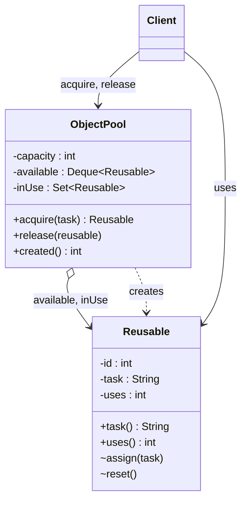

# ♻️ Object Pool

*Creational pattern.*

## Intent

Reuse a bounded set of expensive-to-create objects by lending them out and
taking them back, instead of creating and discarding one per use [25, Object
Pool; 20, Pooling].

*Principles:* [Single responsibility principle](../principles.md#single-responsibility-principle), [Encapsulate what varies](../principles.md#encapsulate-what-varies).

## Motivation

A database connection, a thread, a large buffer or a parser are costly to
construct and often costly to destroy, yet each is needed only for a short
task. Creating one per task wastes the cost of construction every time and
lets the number of live objects grow without limit. An object pool keeps a
bounded set of such objects: a client asks the pool for one, uses it, and
gives it back; the pool creates an object only when none is idle and the
bound has not been reached, resets a returned object so the next client sees
a clean one, and refuses (or makes the client wait) when every object is in
use. The client never constructs the object itself, so the policy for
creating, limiting and recycling lives in one place.

Kircher and Jain describe the general form as *Pooling* in their patterns for
resource management [20]; Grand catalogues it as *Object Pool* [25]. The
Flyweight pattern also shares objects, but shares them simultaneously and
immutably; a pooled object is mutable and belongs to one client at a time.

## Structure



## Participants

| Role [25] | Responsibility | Java | Python | TypeScript | JavaScript |
|---|---|---|---|---|---|
| Reusable | The pooled object; expensive to create, cheap to reset. Knows the task it serves and how often it has been lent. | [`Reusable`](../../java/src/main/java/com/penapereira/patterns/objectpool/Reusable.java) | [`Reusable`](../../python/src/patterns/objectpool/reusable.py) | [`Reusable`](../../typescript/src/object-pool/reusable.ts) | [`Reusable`](../../javascript/src/object-pool/reusable.js) |
| ReusablePool | Creates objects lazily up to a capacity, lends idle ones first, resets and recycles released ones, refuses when exhausted. | [`ObjectPool`](../../java/src/main/java/com/penapereira/patterns/objectpool/ObjectPool.java) | [`ObjectPool`](../../python/src/patterns/objectpool/object_pool.py) | [`ObjectPool`](../../typescript/src/object-pool/object-pool.ts) | [`ObjectPool`](../../javascript/src/object-pool/object-pool.js) |
| Client | Acquires an object for a task and releases it afterwards; never constructs one. | [`ObjectPoolExample`](../../java/src/main/java/com/penapereira/patterns/objectpool/ObjectPoolExample.java) | [`ObjectPoolExample`](../../python/src/patterns/objectpool/example.py) | [`objectPoolExample`](../../typescript/src/object-pool/example.ts) | [`objectPoolExample`](../../javascript/src/object-pool/example.js) |

## The example

A pool of capacity two serves three tasks. The first two acquisitions create
objects; the third finds the pool exhausted and is refused. Once the first
object is released, the third task gets it back, reset, on its second use:

```
Executing Object Pool Pattern Implementation
  Task A -> Reusable#1 (use 1)
  Task B -> Reusable#2 (use 1)
  Task C -> pool exhausted, 2 of 2 in use
  Released Reusable#1
  Task C -> Reusable#1 (use 2)
  Created 2 objects for 4 requests
```

Run it with `make run P=object-pool`.

## Consequences

* **Bounded resource use**: the capacity caps how many expensive objects exist
  at once, which is the point for connections and threads.
* **Amortised construction cost**: an object created once serves many tasks.
* **Reset is the client's safety**: a returned object must be cleared of
  per-use state, or the next client inherits it. Forgetting to release an
  object leaks it from the pool for good.
* **Exhaustion policy** is a design decision: refuse, block, or grow. The
  example refuses; a blocking pool is a monitor (see Producer/Consumer).
* **Thread safety** must be added when clients run concurrently; the example
  is single-threaded and shows only the lifecycle.

## Language notes

* **Java.** `java.util.concurrent.ThreadPoolExecutor` pools threads, JDBC
  connection pools such as HikariCP pool connections, and `ByteBuffer`
  allocators in network libraries pool buffers. The idle objects sit in an
  `ArrayDeque` (FIFO so every object is exercised evenly); `LinkedHashSet`
  keeps the in-use set deterministic. Package-private `assign` and `reset`
  keep the lifecycle in the pool's hands.
* **Python.** `multiprocessing.pool.Pool` and `concurrent.futures` pool
  workers; database drivers offer connection pools. A `collections.deque` and
  a `set` play the same roles; the error is a `RuntimeError`.
* **TypeScript.** Connection pools (`pg.Pool`) and object pools in game
  engines are the common cases. The same two collections, an array as queue
  and a `Set`; the error is an `Error` with the same message.
* **JavaScript.** As TypeScript, without the types.

## Related patterns

* **Flyweight**: shares immutable objects among many clients at once; a pool
  lends mutable objects to one client at a time.
* **Singleton**: a pool of capacity one that never releases is a lazily
  created singleton.
* **Factory Method**: a pool that must create objects of a configurable kind
  delegates creation to a factory.
* **Producer/Consumer**: a blocking pool is a bounded buffer of idle objects.

## References

See [`references.md`](../references.md).

1. Grand, *Patterns in Java, Volume 1*, Object Pool [25].
2. Kircher and Jain, *Pattern-Oriented Software Architecture, Volume 3*,
   Pooling [20].
