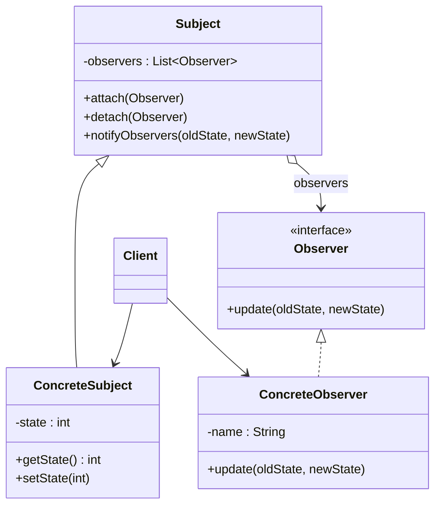

# 👓 Observer

*Behavioural pattern. Also known as* Dependents, Publish-Subscribe.

## Intent

Define a one-to-many dependency between objects so that when one object
changes state, all its dependents are notified and updated automatically
[1, p. 293].

## Motivation

A spreadsheet cell and the charts drawn from it must stay consistent, yet the
cell should not know which charts exist or how they render. Observer separates
the *subject* holding the state from the *observers* interested in it.
Observers register with the subject; the subject notifies every registered
observer when its state changes and each observer pulls or receives whatever
it needs. The subject depends only on an abstract observer interface, so
observers can be added without modifying it.

## Structure



## Participants

| Role [1] | Responsibility | Java | Python | TypeScript | JavaScript |
|---|---|---|---|---|---|
| Subject | Knows its observers; offers `attach()`, `detach()` and `notifyObservers()`. | [`Subject`](../../java/src/main/java/com/penapereira/patterns/observer/Subject.java) | [`Subject`](../../python/src/patterns/observer/subject.py) (`attach`, `detach`, `notify_observers`) | [`Subject`](../../typescript/src/observer/subject.ts) | [`Subject`](../../javascript/src/observer/subject.js) |
| ConcreteSubject | Holds the state of interest and notifies when it changes. | [`ConcreteSubject`](../../java/src/main/java/com/penapereira/patterns/observer/ConcreteSubject.java) | [`ConcreteSubject`](../../python/src/patterns/observer/concrete_subject.py) (`set_state`, `get_state`) | [`ConcreteSubject`](../../typescript/src/observer/concrete-subject.ts) | [`ConcreteSubject`](../../javascript/src/observer/concrete-subject.js) |
| Observer | The notification interface: `update(oldState, newState)`. | [`Observer`](../../java/src/main/java/com/penapereira/patterns/observer/Observer.java) | [`Observer`](../../python/src/patterns/observer/observer.py) (Protocol) | [`Observer`](../../typescript/src/observer/observer.ts) | implicit: any object with `update()` |
| ConcreteObserver | Reports the change it was told about. | [`ConcreteObserver`](../../java/src/main/java/com/penapereira/patterns/observer/ConcreteObserver.java) | [`ConcreteObserver`](../../python/src/patterns/observer/concrete_observer.py) | [`ConcreteObserver`](../../typescript/src/observer/concrete-observer.ts) | [`ConcreteObserver`](../../javascript/src/observer/concrete-observer.js) |
| Client | Wires subject and observers and drives the changes. | [`ObserverExample`](../../java/src/main/java/com/penapereira/patterns/observer/ObserverExample.java) | [`ObserverExample`](../../python/src/patterns/observer/example.py) | [`observerExample`](../../typescript/src/observer/example.ts) | [`observerExample`](../../javascript/src/observer/example.js) |

The example uses the *push* model: the notification carries the old and new
values, so observers need not query the subject.
## The example

The client attaches two observers to one subject and changes the state; both
report. It then detaches the second observer and changes the state again; only
the first reports:

```
Executing Observer Pattern Implementation
  observer1 notified: state 0 -> 5
  observer2 notified: state 0 -> 5
  observer1 notified: state 5 -> 10
```

Setting the state to its current value notifies nobody; the tests cover that
and the notification order. Run it with `make run P=observer`.

## Consequences

* **Abstract coupling** between subject and observer: the subject knows only
  that it has a list of observers.
* **Support for broadcast.** The subject does not care how many observers
  there are.
* **Unexpected updates.** Because observers are ignorant of one another, a
  seemingly innocent change can cascade, and the cost of an update is not
  visible at the call site.
* **The lapsed-listener problem.** An observer that is never detached stays
  reachable from the subject and cannot be garbage collected; `detach()` is
  part of the contract for that reason.

## Language notes

* **Java.** `java.beans.PropertyChangeSupport` is the JavaBeans realisation of
  the pattern [13] and remains idiomatic for in-process observation; the
  original project used it. `java.util.Observable` is deprecated since Java 9
  because it is a class rather than an interface, offers no thread-safety
  guarantees and does not specify notification order [14]. Swing listeners,
  Spring's `ApplicationEvent` and the `java.util.concurrent.Flow` interfaces
  are the pattern at different scales. `Observer` here is a functional
  interface, so a lambda can observe.
* **Python.** Observers are usually plain callables kept in a list; the
  `Observer` Protocol is satisfied by any object with `update`. The standard
  library's `logging` handlers and `asyncio` futures' done-callbacks are
  observers.
* **TypeScript.** `EventTarget` in the browser and `EventEmitter` in Node are
  the platform's built-in subjects; RxJS generalises the pattern into
  observable streams. The explicit classes here show the structure those
  libraries hide.
* **JavaScript.** As TypeScript; `addEventListener`/`removeEventListener`
  are `attach`/`detach` under other names.

## Related patterns

* **Mediator**: when the update logic between many subjects and observers
  becomes complex, a mediator can centralise it.
* **Singleton**: a mediator or change manager is often unique.

## References

See [`references.md`](../references.md).

1. Gamma, Helm, Johnson and Vlissides, *Design Patterns*, pp. 293–303.
3. Freeman and Robson, *Head First Design Patterns*, 2nd ed., ch. 2.
13. Hamilton (ed.), *JavaBeans API Specification*, §7.
14. Oracle, *Java Platform SE API Specification*, `java.util.Observable` deprecation note.
