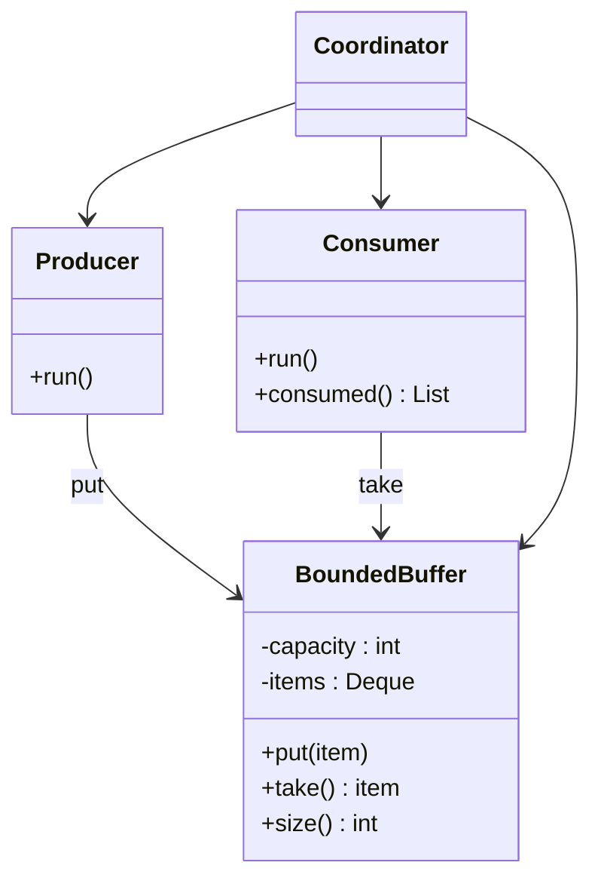

# 🔄 Producer/Consumer

*Concurrency construct. Also known as the* bounded-buffer problem.

## Intent

Coordinate threads that generate data with threads that process it through a
bounded, thread-safe buffer. A producer waits while the buffer is full, a
consumer waits while it is empty, and concurrent access never corrupts the
buffer or loses or duplicates an item.

## Motivation

Two kinds of activities share a buffer of finite capacity. *Producers* generate
items and place them in the buffer; *consumers* remove items and process them.
The problem was posed by Dijkstra in 1965 as the motivating example for
semaphores [15]. Hoare [5] and Brinch Hansen [6] later introduced the
*monitor*, which bundles the shared data, the operations on it and the
condition synchronisation into one construct, and the bounded buffer is the
standard illustration in both papers. `BoundedBuffer` here is that monitor,
written by hand: one lock, a *not full* condition and a *not empty* condition.

## Structure



## Participants

| Role | Responsibility | Java | Python | TypeScript | JavaScript |
|---|---|---|---|---|---|
| BoundedBuffer | Mutual exclusion plus the two wait conditions; `put()` waits while full, `take()` waits while empty; FIFO. | [`BoundedBuffer`](../../java/src/main/java/com/penapereira/patterns/producerconsumer/BoundedBuffer.java) (`ReentrantLock`, two `Condition`s) | [`BoundedBuffer`](../../python/src/patterns/producerconsumer/bounded_buffer.py) (`threading.Condition`) | [`BoundedBuffer`](../../typescript/src/producer-consumer/bounded-buffer.ts) (generator `put`/`take`) | [`BoundedBuffer`](../../javascript/src/producer-consumer/bounded-buffer.js) |
| Producer | Puts its items into the buffer in order. | [`Producer`](../../java/src/main/java/com/penapereira/patterns/producerconsumer/Producer.java) | [`Producer`](../../python/src/patterns/producerconsumer/producer.py) | [`Producer`](../../typescript/src/producer-consumer/producer.ts) | [`Producer`](../../javascript/src/producer-consumer/producer.js) |
| Consumer | Takes items until it takes the poison pill, recording each. | [`Consumer`](../../java/src/main/java/com/penapereira/patterns/producerconsumer/Consumer.java) | [`Consumer`](../../python/src/patterns/producerconsumer/consumer.py) | [`Consumer`](../../typescript/src/producer-consumer/consumer.ts) | [`Consumer`](../../javascript/src/producer-consumer/consumer.js) |
| Coordinator | Creates buffer, producer and consumers, runs them, delivers the poison pills, waits, reports. | [`ProducerConsumerExample`](../../java/src/main/java/com/penapereira/patterns/producerconsumer/ProducerConsumerExample.java) | [`ProducerConsumerExample`](../../python/src/patterns/producerconsumer/example.py) | [`producerConsumerExample`](../../typescript/src/producer-consumer/example.ts) (+ `runTasks` scheduler) | [`producerConsumerExample`](../../javascript/src/producer-consumer/example.js) |
## The example

One producer offers the items 1 to 5 to a buffer of capacity 2 while two
consumers drain it. Which consumer takes which item depends on scheduling and
differs between runs and languages, so the example prints what does *not*
vary: what was produced, what was consumed (sorted) and that every item was
consumed exactly once.

```
Executing Producer/Consumer Pattern Implementation
  Buffer capacity 2, 1 producer, 2 consumers
  Produced: 1 2 3 4 5
  Consumed: 1 2 3 4 5
  Each item consumed exactly once: true
```

The tests additionally show `put()` blocking on a full buffer, `take()`
blocking on an empty one, and clean shutdown. Run it with
`make run P=producer-consumer`.

## Consequences

* **Decoupling of rates.** Producers and consumers run at their own pace; the
  buffer absorbs short-term differences.
* **Backpressure.** A *bounded* buffer makes a fast producer wait rather than
  exhaust memory. Goetz et al. recommend bounded queues by default for exactly
  this reason [4, §5.3].
* **Shutdown needs a protocol.** A consumer blocked in `take()` has no natural
  end. The coordinator sends one *poison pill* per consumer; the alternative
  is interruption, which Java and Python support and the doc's Language notes
  discuss [4, ch. 7].
* **Lost signals and spurious wake-ups**, the classic hazards of hand-written
  monitors, are avoided by re-checking the condition in a loop after every
  wait, which all four buffers do.

## Language notes

* **Java.** `BoundedBuffer` is what `java.util.concurrent.ArrayBlockingQueue`
  does internally: a `ReentrantLock` and two `Condition`s, `notFull` and
  `notEmpty`, from the `java.util.concurrent` package designed by Lea [16].
  In production code use the library queue; the original project did. The
  companion repository
  [java-monitor-example](https://github.com/lpenap/java-monitor-example)
  builds the same coordination with `synchronized`, `wait()` and `notifyAll()`.
* **Python.** `threading.Condition` plays both roles with `wait_for()`;
  `queue.Queue(maxsize)` is the library equivalent. The GIL serialises
  bytecode but not the check-then-act on the deque, so the lock is still
  required.
* **TypeScript and JavaScript.** There are no shared-memory threads in a
  single realm, so the construct is shown with *cooperative tasks*: `put()` and
  `take()` are generator functions that `yield` only when they would block,
  producer and consumer are generators that `yield*` them, and a round-robin
  scheduler calls `next()` on every live task in turn. This is the wait/signal
  discipline without preemption, and it makes the run fully deterministic; the
  scheduler also detects a round in which no task progressed and reports a
  deadlock. With real parallelism (`worker_threads` and `SharedArrayBuffer`)
  the same buffer would be written with `Atomics.wait` and `Atomics.notify`.

## Related patterns

* **Monitor**: the underlying synchronisation construct (see the companion
  project above).
* **Semaphore**: Dijkstra's original solution uses two counting semaphores,
  *empty* and *full*, plus a binary semaphore for mutual exclusion [15].
* **Observer**: an asynchronous variant in which consumers are notified rather
  than blocked.

## References

See [`references.md`](../references.md).

4. Goetz et al., *Java Concurrency in Practice*, ch. 5 and ch. 7.
5. Hoare, "Monitors: An Operating System Structuring Concept," 1974.
6. Brinch Hansen, *Operating System Principles*, 1973.
15. Dijkstra, "Cooperating Sequential Processes," 1965.
16. Lea, *Concurrent Programming in Java*, 2nd ed.
