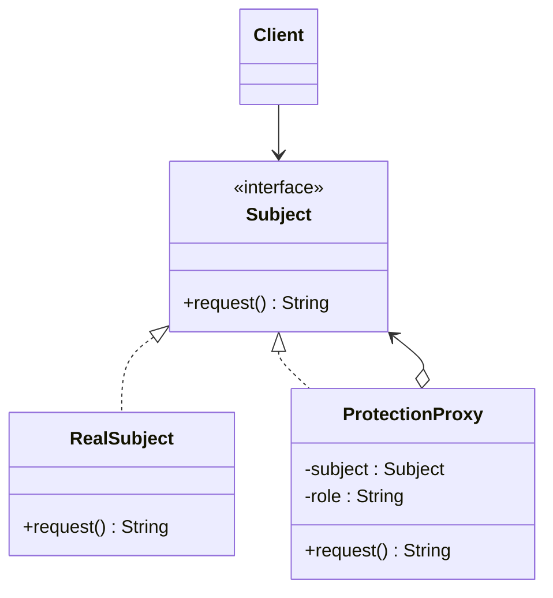

# ☔ Protection Proxy

*Structural pattern. A variant of* Proxy, *also known as* Surrogate.

## Intent

Provide a surrogate or placeholder for another object to control access to it
[1, p. 207]. A **protection proxy** controls access by checking that the caller
has the right to make the request before forwarding it to the real subject.

## Motivation

An object may be sensitive: a document that only its owner may edit, an
administrative operation that only privileged users may invoke. Scattering
permission checks through every client is brittle. Placing the object behind
a proxy with the same interface keeps clients unchanged while the proxy
decides, per request, whether to forward. Gamma et al. list four common
proxies: *remote* (the subject lives in another address space), *virtual*
(create expensive objects on demand, see [Virtual Proxy](virtual-proxy.md)),
*protection* (this one) and *smart reference* (extra housekeeping on access)
[1, p. 208].

## Structure



## Participants

| Role [1] | Responsibility | Java | Python | TypeScript | JavaScript |
|---|---|---|---|---|---|
| Subject | The common interface of real subject and proxy, so the proxy can stand in anywhere. | [`Subject`](../../java/src/main/java/com/penapereira/patterns/protectionproxy/Subject.java) | [`Subject`](../../python/src/patterns/protectionproxy/__init__.py) (Protocol) | [`Subject`](../../typescript/src/protection-proxy/protection-proxy.ts) | implicit: any object with `request()` |
| RealSubject | The object the proxy represents. | [`RealSubject`](../../java/src/main/java/com/penapereira/patterns/protectionproxy/RealSubject.java) | `RealSubject` | `RealSubject` | `RealSubject` |
| Proxy | Holds a reference to the subject and a caller role; forwards or refuses. | [`ProtectionProxy`](../../java/src/main/java/com/penapereira/patterns/protectionproxy/ProtectionProxy.java) | `ProtectionProxy` | `ProtectionProxy` | `ProtectionProxy` |
| Client | Uses the subject through the `Subject` interface, unaware of the proxy. | [`ProtectionProxyExample`](../../java/src/main/java/com/penapereira/patterns/protectionproxy/ProtectionProxyExample.java) | `ProtectionProxyExample` | [`protectionProxyExample`](../../typescript/src/protection-proxy/example.ts) | [`protectionProxyExample`](../../javascript/src/protection-proxy/example.js) |

## The example

One real subject is wrapped in two proxies carrying different caller roles.
The client makes the same call through each:

```
Executing Protection Proxy Pattern Implementation
  admin: RealSubject.request()
  guest: access denied by ProtectionProxy
```

The tests show the real subject is not invoked at all when access is denied.
Run it with `make run P=protection-proxy`.

## Consequences

* **A level of indirection** that lets the proxy add housekeeping, here an
  access check, without the client or the real subject knowing.
* **The check lives in one place** rather than in every client.
* **Copy-on-write** and other optimisations are possible in the proxy because
  it sees every access.
* The proxy must **mirror the subject's interface** and keep up with it as it
  evolves.

## Language notes

* **Java.** `java.lang.reflect.Proxy` creates a proxy for any set of
  interfaces at run time with an `InvocationHandler`, which is how method-level
  security in frameworks such as Spring Security (`@PreAuthorize`) is
  implemented. `Collections.unmodifiableList` is a protection proxy that
  refuses mutators.
* **Python.** `__getattr__` forwarding makes a generic proxy a few lines
  long; the explicit class here mirrors the diagram. `weakref.proxy` is a
  smart-reference proxy in the standard library.
* **TypeScript.** The built-in `Proxy` object intercepts property access and
  calls on any target; typed as `Subject` it is indistinguishable from the
  real thing. The class form is kept so the participants are visible.
* **JavaScript.** `new Proxy(target, handler)` with a `get` trap is the
  language-level realisation; membranes and revocable proxies
  (`Proxy.revocable`) are protection proxies.

## Related patterns

* **Virtual Proxy**: same structure, different purpose; see
  [virtual-proxy.md](virtual-proxy.md).
* **Adapter** provides a different interface; Proxy provides the same one.
* **Decorator** adds responsibilities; Proxy controls access. The two look
  alike in code and differ in intent.

## References

See [`references.md`](../references.md).

1. Gamma, Helm, Johnson and Vlissides, *Design Patterns*, pp. 207–217.
3. Freeman and Robson, *Head First Design Patterns*, 2nd ed., ch. 11.
