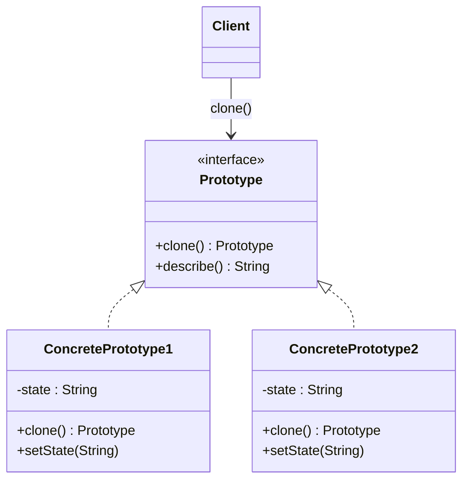

# 🃏 Prototype

*Creational pattern.*

## Intent

Specify the kinds of objects to create using a prototypical instance, and
create new objects by copying this prototype [1, p. 117].

*Principles:* [Encapsulate what varies](../principles.md#encapsulate-what-varies), [Open-closed principle](../principles.md#open-closed-principle).

## Motivation

A music editor's palette offers notes, rests and staves; the framework class
that places a chosen tool's object on the score should not know the concrete
classes, and subclassing the tool for every kind of object multiplies classes
pointlessly. Instead each tool holds a *prototype*: a fully configured
instance of the object it creates. Placing an object means cloning the
prototype. New kinds of objects need no new tool class, only a new prototype
handed to an existing tool, and the prototype can be configured at run time.

## Structure



## Participants

| Role [1] | Responsibility | Java | Python | TypeScript | JavaScript |
|---|---|---|---|---|---|
| Prototype | Declares the interface for cloning itself. | [`Prototype`](../../java/src/main/java/com/penapereira/patterns/prototype/Prototype.java) | [`Prototype`](../../python/src/patterns/prototype/prototype.py) (Protocol) | [`Prototype`](../../typescript/src/prototype/prototype.ts) | implicit: any object with `clone()` and `describe()` |
| ConcretePrototype | Implements the cloning operation, copying its own state. | [`ConcretePrototype1`](../../java/src/main/java/com/penapereira/patterns/prototype/ConcretePrototype1.java), [`ConcretePrototype2`](../../java/src/main/java/com/penapereira/patterns/prototype/ConcretePrototype2.java) | [`ConcretePrototype1`](../../python/src/patterns/prototype/concrete_prototype1.py), [`ConcretePrototype2`](../../python/src/patterns/prototype/concrete_prototype2.py) | [`ConcretePrototype1`](../../typescript/src/prototype/concrete-prototype1.ts), [`ConcretePrototype2`](../../typescript/src/prototype/concrete-prototype2.ts) | [`ConcretePrototype1`](../../javascript/src/prototype/concrete-prototype1.js), [`ConcretePrototype2`](../../javascript/src/prototype/concrete-prototype2.js) |
| Client | Creates new objects by asking a prototype to clone itself. | [`PrototypeExample`](../../java/src/main/java/com/penapereira/patterns/prototype/PrototypeExample.java) | [`PrototypeExample`](../../python/src/patterns/prototype/example.py) | [`prototypeExample`](../../typescript/src/prototype/example.ts) | [`prototypeExample`](../../javascript/src/prototype/example.js) |
## The example

The client clones a configured prototype, shows the clone is a distinct object
with equal state, changes the clone and shows the original is unaffected, then
clones a prototype of the second class:

```
Executing Prototype Pattern Implementation
  Original: ConcretePrototype1(state=alpha)
  Clone: ConcretePrototype1(state=alpha)
  Clone is a distinct object: true
  Clone after setState(beta): ConcretePrototype1(state=beta)
  Original after the clone changed: ConcretePrototype1(state=alpha)
  ConcretePrototype2 clone: ConcretePrototype2(state=gamma)
```

Run it with `make run P=prototype`.

## Consequences

* **Adding and removing products at run time** by registering a prototypical
  instance.
* **Specifying new objects by varying values or structure**: configure a
  prototype, then clone it many times.
* **Reduced subclassing** compared with Factory Method's parallel creator
  hierarchy.
* **Every class must implement clone**, which is hard when objects contain
  circular references or resources that cannot be shared. *Shallow* copy
  shares referenced objects between original and clone; *deep* copy
  duplicates them. The right choice depends on the class, and the pattern
  forces the decision.

## Language notes

* **Java.** `Cloneable` and `Object.clone()` are the language's built-in
  mechanism, and Bloch recommends avoiding them in favour of copy constructors
  or copy factories [2, Item 13]: `clone()` bypasses constructors, its
  contract is weak and `Cloneable` has no `clone` method. `Prototype.clone()`
  here is an ordinary interface method implemented with a copy constructor,
  with a covariant return type in each concrete class.
* **Python.** `copy.copy` and `copy.deepcopy` implement shallow and deep
  copying for any object, customisable through `__copy__` and `__deepcopy__`;
  `clone()` here delegates to `copy.copy`. `dataclasses.replace` is a
  copy-with-changes idiom.
* **TypeScript.** Spread (`{ ...obj }`) and `structuredClone` copy plain data,
  but lose the prototype chain and methods, which is why a class defines its
  own `clone()`. The return type can be narrowed to the concrete class.
* **JavaScript.** The language's object model *is* prototype-based:
  `Object.create(proto)` makes a new object whose prototype is an existing one,
  the purest form of the pattern. Copying state still needs an explicit
  `clone()` as shown.

## Related patterns

* **Abstract Factory** can store a set of prototypes and clone them, instead of
  instantiating classes.
* **Composite** and **Decorator** structures are natural prototypes: build one
  once, clone it many times.

## References

See [`references.md`](../references.md).

1. Gamma, Helm, Johnson and Vlissides, *Design Patterns*, pp. 117–126.
2. Bloch, *Effective Java*, 3rd ed., Item 13.
