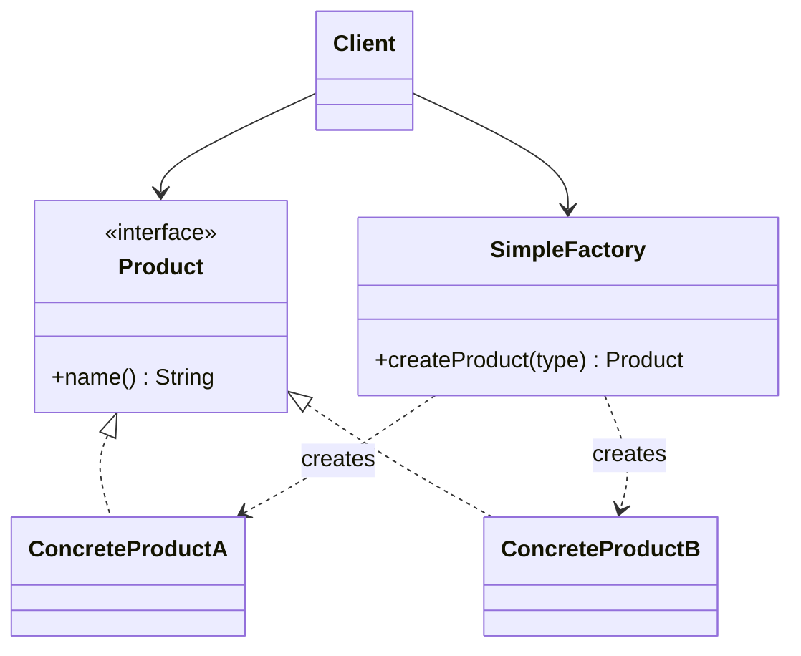

# 🏗️ Simple Factory

*Creational idiom.*

## Intent

Centralise the creation of a family of related products behind a single method
that decides which concrete class to instantiate, so that clients depend only
on the product interface.

*Principles:* [Encapsulate what varies](../principles.md#encapsulate-what-varies), [Single responsibility principle](../principles.md#single-responsibility-principle).

## Motivation

Code that instantiates concrete classes directly is tied to them: adding a
product, renaming one or changing how it is built means editing every client.
Gathering those decisions into one place removes the duplication and gives the
rest of the program a single point through which products are obtained.

The Simple Factory is not one of the twenty-three patterns catalogued by Gamma
et al. Freeman and Robson describe it as "not actually a Design Pattern; it's
more of a programming idiom" [3, ch. 4]. It is nevertheless the form most
programmers meet first, and it is the stepping stone to the two genuine
creational patterns in this collection: the *parameterised factory method*
variant of Factory Method [1, p. 110] and Abstract Factory. Bloch's discussion
of static factory methods covers the same ground from the API designer's point
of view [2, Item 1].

## Structure



## Participants

| Role | Responsibility | Java | Python | TypeScript | JavaScript |
|---|---|---|---|---|---|
| Product | The interface every product implements: `name()`. | [`Product`](../../java/src/main/java/com/penapereira/patterns/simplefactory/Product.java) | [`Product`](../../python/src/patterns/simplefactory/product.py) (Protocol) | [`Product`](../../typescript/src/simple-factory/product.ts) | implicit: any object with `name()` ([`simple-factory/`](../../javascript/src/simple-factory/)) |
| ConcreteProduct | The classes the factory can instantiate. | [`ConcreteProductA`](../../java/src/main/java/com/penapereira/patterns/simplefactory/ConcreteProductA.java), [`ConcreteProductB`](../../java/src/main/java/com/penapereira/patterns/simplefactory/ConcreteProductB.java) | [`ConcreteProductA`](../../python/src/patterns/simplefactory/concrete_product_a.py), [`ConcreteProductB`](../../python/src/patterns/simplefactory/concrete_product_b.py) | [`ConcreteProductA`](../../typescript/src/simple-factory/concrete-product-a.ts), [`ConcreteProductB`](../../typescript/src/simple-factory/concrete-product-b.ts) | [`ConcreteProductA`](../../javascript/src/simple-factory/concrete-product-a.js), [`ConcreteProductB`](../../javascript/src/simple-factory/concrete-product-b.js) |
| Factory | `createProduct(type)` maps a type code to a concrete product and rejects unknown codes. | [`SimpleFactory`](../../java/src/main/java/com/penapereira/patterns/simplefactory/SimpleFactory.java) | [`SimpleFactory`](../../python/src/patterns/simplefactory/simple_factory.py) (`create_product`) | [`SimpleFactory`](../../typescript/src/simple-factory/simple-factory.ts) | [`SimpleFactory`](../../javascript/src/simple-factory/simple-factory.js) |
| Client | Requests products by type code and uses them through `Product`. | [`SimpleFactoryExample`](../../java/src/main/java/com/penapereira/patterns/simplefactory/SimpleFactoryExample.java) | [`SimpleFactoryExample`](../../python/src/patterns/simplefactory/example.py) | [`simpleFactoryExample`](../../typescript/src/simple-factory/example.ts) | [`simpleFactoryExample`](../../javascript/src/simple-factory/example.js) |
## The example

The client asks the factory for a product of type `"A"` and one of type `"B"`
and prints their names:

```
Executing Simple Factory Pattern Implementation
  ConcreteProductA
  ConcreteProductB
```

The tests in every language also cover the rejection of an unknown type. Run it
with `make run P=simple-factory`.

## Consequences

* **Creation is encapsulated** in one class, and clients are written against
  `Product` alone.
* **The factory violates the open-closed principle** [9]: supporting a new
  product requires modifying the selection. Factory Method addresses this
  through subclassing and Abstract Factory through substituting whole
  factories, which is precisely what distinguishes them from the idiom.
* **The selection is data-driven**, which is convenient when the type code
  comes from configuration or user input.

## Language notes

* **Java.** A `switch` *expression* must be exhaustive, hence the `default`
  branch throwing `IllegalArgumentException`. Were the type codes an `enum` or
  the products a `sealed` hierarchy, the compiler could verify every case is
  handled and the runtime exception would disappear.
* **Python.** A `match` statement raising `ValueError` mirrors the Java
  version. The more common Python idiom is a dict from type code to class,
  `{"A": ConcreteProductA, "B": ConcreteProductB}[type]()`, because classes are
  callables; the explicit method is kept to match the diagram.
* **TypeScript.** The parameter is typed `string` rather than `"A" | "B"` on
  purpose: the point of the idiom is a run-time decision on data, and a literal
  union would move the check to compile time and make the rejection branch
  unreachable.
* **JavaScript.** Same shape as TypeScript with a thrown `Error`. As in Python,
  an object literal mapping codes to classes is the everyday form.

## Related patterns

* **Factory Method** moves the decision into subclasses of a creator.
* **Abstract Factory** groups several factory operations into one object per
  product family.

## References

See [`references.md`](../references.md).

1. Gamma, Helm, Johnson and Vlissides, *Design Patterns*, pp. 107–116.
2. Bloch, *Effective Java*, 3rd ed., Item 1.
3. Freeman and Robson, *Head First Design Patterns*, 2nd ed., ch. 4.
9. Meyer, *Object-Oriented Software Construction*, §2.3.
