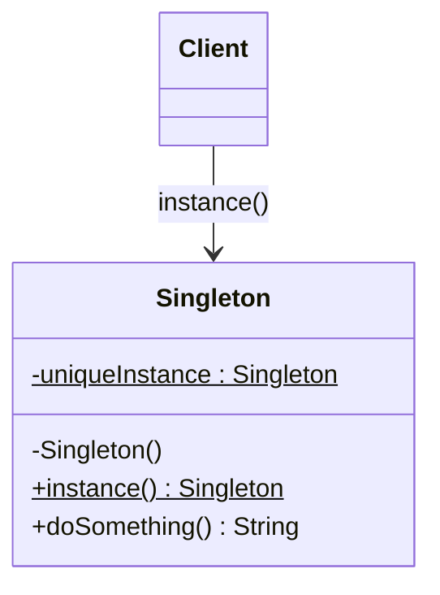

# 💍 Singleton

*Creational pattern.*

## Intent

Ensure a class has only one instance, and provide a global point of access to
it [1, p. 127].

## Motivation

Some objects must be unique: a print spooler, a window manager, a registry of
configuration. A global variable makes the instance accessible but does not
stop a second one from being created. Making the class itself responsible for
its sole instance solves both problems: the constructor is hidden, and a class
operation creates the instance on first use and returns it thereafter.

## Structure



## Participants

| Role [1] | Responsibility | Java | Python | TypeScript | JavaScript |
|---|---|---|---|---|---|
| Singleton | Hidden constructor, private static `uniqueInstance`, and the class operation `instance()` that lazily creates and returns it. `doSomething()` stands for the instance's real responsibilities. | [`Singleton`](../../java/src/main/java/com/penapereira/patterns/singleton/Singleton.java) | [`Singleton`](../../python/src/patterns/singleton/__init__.py) (`instance` classmethod, `do_something`) | [`Singleton`](../../typescript/src/singleton/singleton.ts) | [`Singleton`](../../javascript/src/singleton/singleton.js) |
| Client | Obtains the instance through `instance()` only. | [`SingletonExample`](../../java/src/main/java/com/penapereira/patterns/singleton/SingletonExample.java) | `SingletonExample` | [`singletonExample`](../../typescript/src/singleton/example.ts) | [`singletonExample`](../../javascript/src/singleton/example.js) |

## The example

The client calls `instance()` twice, reports whether both calls returned the
same object, and calls `doSomething()` on it:

```
Executing Singleton Pattern Implementation
  Same instance returned twice: true
  Singleton is doing something
```

The tests assert the same identity in every language. Run it with
`make run P=singleton`.

## Consequences

* **Controlled access to the sole instance** and **reduced namespace
  pollution** compared with a global variable.
* **Permits refinement.** The class can be subclassed and the subclass chosen
  at run time inside `instance()`.
* **Permits a variable number of instances** by changing only `instance()`,
  should the requirement change.
* **Hidden dependencies and global state.** Every class that calls
  `Singleton.instance()` depends on it invisibly, which hampers testing and
  substitution. This is why the pattern is often called an anti-pattern in
  modern practice, and why dependency-injection containers prefer to manage
  uniqueness as a *scope* instead.

## Language notes

The lazy initialisation in `instance()` is the textbook form in all four
implementations and is **not thread-safe** where threads exist: two threads
that both observe the field empty before either assigns it will create two
instances, a check-then-act race [4, §2.2]. The examples are single-threaded
and written this way to show the canonical structure.

* **Java.** The constructor is `private`, so `new Singleton()` does not
  compile outside the class. Thread-safe alternatives: eager initialisation
  (`private static final Singleton INSTANCE = new Singleton();`, exactly-once
  by the class-initialisation guarantee [10, §12.4.2]); the
  initialisation-on-demand holder idiom [4, §16.2.3]; an `enum` with a single
  constant [2, Item 3], which is also serialisation-safe; or double-checked
  locking on a `volatile` field, correct only under the Java 5 memory model
  [11], the earlier form being famously broken [12].
* **Python.** There are no private constructors; `Singleton()` remains
  callable and the tests only assert that `instance()` is consistent. The
  idiomatic Python singletons are a module (imported once per interpreter) or
  a module-level instance; overriding `__new__` to return a cached object is
  the closest structural equivalent. The GIL does not make the lazy check
  atomic, so a lock is needed under threads.
* **TypeScript.** `private constructor()` is enforced by the compiler; the
  static field and `instance()` mirror Java. JavaScript's single-threaded
  event loop makes the lazy check safe within one realm.
* **JavaScript.** Constructors cannot be private; the instance is kept in a
  `static #uniqueInstance` private field so at least the storage is hidden.
  The everyday idiom is simply an exported module-level object, since ES
  modules are evaluated once.

## Related patterns

* **Abstract Factory**, **Builder** and **Prototype**: the factories these
  patterns introduce are frequently singletons.
* **Façade**: usually a singleton.
* **Monostate**: shares state among many instances instead of restricting
  their number, an alternative when uniqueness of *state* is all that is
  required.

## References

See [`references.md`](../references.md).

1. Gamma, Helm, Johnson and Vlissides, *Design Patterns*, pp. 127–134.
2. Bloch, *Effective Java*, 3rd ed., Item 3.
4. Goetz et al., *Java Concurrency in Practice*, §2.2 and §16.2.
10. *The Java Language Specification*, Java SE 25, §12.4.
11. Manson, Pugh and Adve, "The Java Memory Model," POPL '05.
12. Bacon et al., "The 'Double-Checked Locking is Broken' Declaration."
