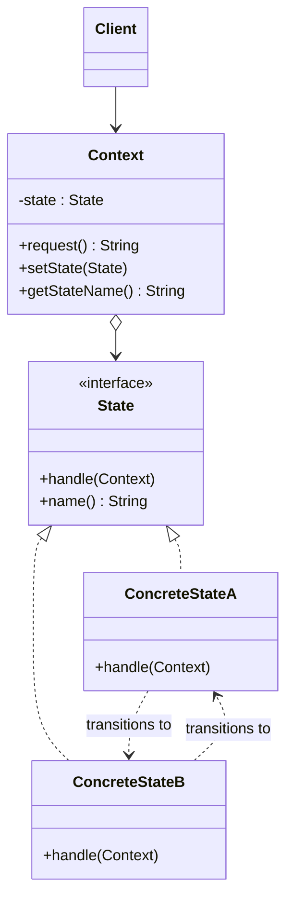

# 🐉 State

*Behavioural pattern. Also known as* Objects for States.

## Intent

Allow an object to alter its behavior when its internal state changes. The
object will appear to change its class [1, p. 305].

## Motivation

A TCP connection responds to `open`, `close` and `acknowledge` differently
depending on whether it is established, listening or closed. Writing every
operation as a `switch` on a state code spreads the state logic over the whole
class and makes adding a state a change to every method. State moves each
state's behaviour into its own class behind a common interface. The connection
holds one state object and delegates to it; the state object performs the
operation and, when appropriate, replaces itself with the next state. The
connection's class never changes, yet its behaviour does.

## Structure



## Participants

| Role [1] | Responsibility | Java | Python | TypeScript | JavaScript |
|---|---|---|---|---|---|
| Context | Defines the interface clients use and holds the current state; delegates state-specific requests to it. | [`Context`](../../java/src/main/java/com/penapereira/patterns/state/Context.java) | [`Context`](../../python/src/patterns/state/context.py) (`request`, `set_state`, `get_state_name`) | [`Context`](../../typescript/src/state/context.ts) | [`Context`](../../javascript/src/state/context.js) |
| State | The interface for behaviour associated with a state of the Context. | [`State`](../../java/src/main/java/com/penapereira/patterns/state/State.java) | `State` (Protocol) | `State` | implicit: any object with `handle` and `name` |
| ConcreteState | Implements the behaviour of one state and decides the transition. | [`ConcreteStateA`](../../java/src/main/java/com/penapereira/patterns/state/ConcreteStateA.java), `ConcreteStateB` | `ConcreteStateA`, `ConcreteStateB` | `ConcreteStateA`, `ConcreteStateB` | `ConcreteStateA`, `ConcreteStateB` |
| Client | Issues requests to the context; never touches states. | [`StateExample`](../../java/src/main/java/com/penapereira/patterns/state/StateExample.java) | `StateExample` | [`stateExample`](../../typescript/src/state/example.ts) | [`stateExample`](../../javascript/src/state/example.js) |

## The example

The client creates a context, which starts in state A, and issues two requests.
Each request is handled by the current state, which then hands the context to
the other state:

```
Executing State Pattern Implementation
  Context in ConcreteStateA
  request() handled by ConcreteStateA, now in ConcreteStateB
  request() handled by ConcreteStateB, now in ConcreteStateA
```

Run it with `make run P=state`.

## Consequences

* **Localises state-specific behaviour** and partitions it by state; adding a
  state is adding a class.
* **Makes state transitions explicit**: the transition is an object
  assignment, not a flag mutation buried in a method.
* **State objects can be shared** when they hold no per-context data
  (Flyweight), as the tests show.
* More classes than a `switch`, which is only worthwhile once there are
  several states with several operations each.

## Language notes

* **Java.** Each state is a class here; an `enum` with per-constant method
  bodies is a compact alternative when the set of states is fixed [2, Item
  34], and sealed interfaces (Java 17) let the compiler check exhaustiveness
  of transitions.
* **Python.** State classes are often replaced by a dict of functions keyed
  by state, or by `enum.Enum` members with methods; the object form shown
  keeps transitions readable. `asyncio` and generator-based protocols encode
  states as suspension points instead.
* **TypeScript.** Discriminated unions plus a reducer (`switch (state.kind)`)
  are the functional counterpart favoured in front-end code; the class form
  puts each state's behaviour with its data. XState is a library-scale State
  pattern.
* **JavaScript.** Same as TypeScript; `Promise` objects are a built-in state
  machine with pending, fulfilled and rejected states whose behaviour changes
  accordingly.

## Related patterns

* **Strategy** has the same structure but a different intent: a strategy is
  chosen by the client and rarely changes, whereas a state changes itself as a
  consequence of the context's own behaviour.
* **Flyweight** explains when and how state objects can be shared.
* **Singleton**: shared state objects are often singletons.

## References

See [`references.md`](../references.md).

1. Gamma, Helm, Johnson and Vlissides, *Design Patterns*, pp. 305–313.
2. Bloch, *Effective Java*, 3rd ed., Item 34.
3. Freeman and Robson, *Head First Design Patterns*, 2nd ed., ch. 10.
