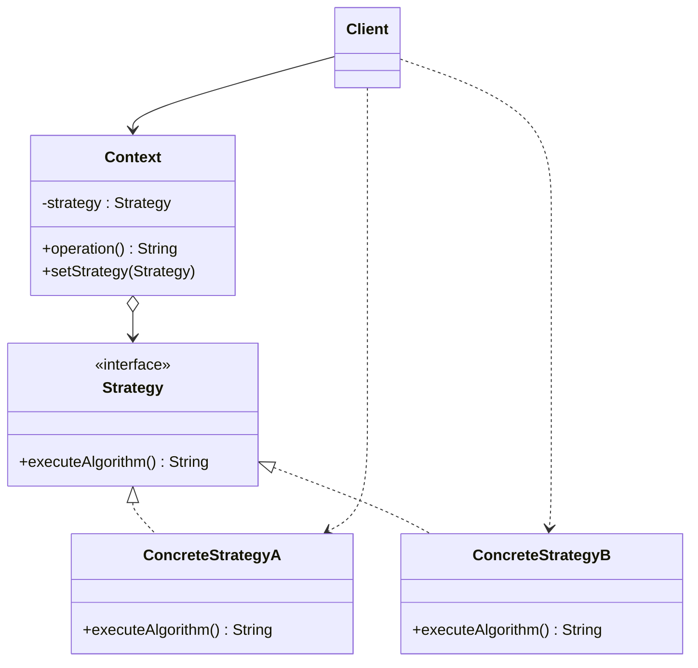

# 💡 Strategy

*Behavioural pattern. Also known as* Policy.

## Intent

Define a family of algorithms, encapsulate each one, and make them
interchangeable. Strategy lets the algorithm vary independently from clients
that use it [1, p. 315].

## Motivation

A text composer may break lines with several algorithms of differing cost and
quality. Hard-wiring them into the composer makes it larger, harder to maintain
and impossible to extend without editing it. Extracting each algorithm into its
own class behind a common interface lets the composer hold a reference to
*some* strategy and delegate to it, so algorithms can be added, removed or
switched at run time without the composer changing.

## Structure



## Participants

| Role [1] | Responsibility | Java | Python | TypeScript | JavaScript |
|---|---|---|---|---|---|
| Strategy | The interface common to all algorithms: `executeAlgorithm()`. | [`Strategy`](../../java/src/main/java/com/penapereira/patterns/strategy/Strategy.java) | [`Strategy`](../../python/src/patterns/strategy/strategy.py) (Protocol, `execute_algorithm`) | [`Strategy`](../../typescript/src/strategy/strategy.ts) | implicit: any object with `executeAlgorithm()` ([`strategy.js`](../../javascript/src/strategy/strategy.js)) |
| ConcreteStrategy | Two interchangeable algorithms. | [`ConcreteStrategyA`](../../java/src/main/java/com/penapereira/patterns/strategy/ConcreteStrategyA.java), [`ConcreteStrategyB`](../../java/src/main/java/com/penapereira/patterns/strategy/ConcreteStrategyB.java) | `ConcreteStrategyA`, `ConcreteStrategyB` | `ConcreteStrategyA`, `ConcreteStrategyB` | `ConcreteStrategyA`, `ConcreteStrategyB` |
| Context | Configured with a strategy at construction, exposes `setStrategy()` to change it and delegates to it from `operation()`. | [`Context`](../../java/src/main/java/com/penapereira/patterns/strategy/Context.java) | `Context` (`set_strategy`) | `Context` | `Context` |
| Client | Chooses the strategies and hands them to the context. | [`StrategyExample`](../../java/src/main/java/com/penapereira/patterns/strategy/StrategyExample.java) | `StrategyExample` | [`strategyExample`](../../typescript/src/strategy/example.ts) | [`strategyExample`](../../javascript/src/strategy/example.js) |

## The example

The client builds a context with the first strategy, invokes the operation,
swaps in the second strategy and invokes it again. The context's code does not
change; only the object it delegates to does.

```
Executing Strategy Pattern Implementation
  Operation with --> algorithm from ConcreteStrategyA
  Operation with ==> algorithm from ConcreteStrategyB
```

Run it with `make run P=strategy`, or in one language with
`make run P=strategy L=python`.

## Consequences

* **Families of related algorithms** can be organised and reused independently
  of the context.
* **An alternative to subclassing the context**, which would fix the algorithm
  at compile time and mix it with the context's other responsibilities.
* **Eliminates conditional statements** that would otherwise select behaviour.
* **Clients must be aware of the strategies** in order to choose one, which
  exposes implementation detail.
* **Communication overhead and object proliferation.** Every strategy shares
  one interface even if some need less information, and each algorithm is a
  class.

## Language notes

A strategy with a single operation is, in every language here, something a
function could stand in for. All four implementations nevertheless keep the
explicit `Strategy`, `ConcreteStrategyA` and `ConcreteStrategyB` so that the
structure in the diagram is visible in the code.

* **Java.** `Strategy` is a functional interface, so a lambda or method
  reference can serve as a concrete strategy without a named class.
  `java.util.Comparator` passed to `List.sort` is the everyday instance: the
  sort is the context, the comparator the strategy. Bloch discusses this
  collapse of the pattern's class count as one of the main benefits of lambdas
  [2, Item 42].
* **Python.** `Strategy` is a `typing.Protocol`: the concrete classes do not
  inherit from it, they merely have the right method (structural typing). In
  idiomatic code the strategy is usually just a callable passed to the context,
  as with the `key=` argument of `sorted`. Method names are `snake_case`
  (`execute_algorithm`, `set_strategy`).
* **TypeScript.** `Strategy` is an `interface`; because TypeScript types are
  structural, any object with a matching `executeAlgorithm()` conforms without
  `implements`. A `type Strategy = () => string` would be the function-typed
  variant.
* **JavaScript.** There is no interface at all: `Context` calls
  `executeAlgorithm()` on whatever it was given. The two concrete classes exist
  only to name the roles; duck typing is the language's version of the pattern.

## Related patterns

* **Template Method** varies steps of an algorithm through inheritance;
  Strategy varies the whole algorithm through composition.
* **State** has the same structure, but the context changes its state object as
  a consequence of its own behaviour, whereas a strategy is chosen by the
  client.
* **Flyweight**: stateless strategies can be shared.

## References

See [`references.md`](../references.md).

1. Gamma, Helm, Johnson and Vlissides, *Design Patterns*, pp. 315–323.
2. Bloch, *Effective Java*, 3rd ed., Item 42.
3. Freeman and Robson, *Head First Design Patterns*, 2nd ed., ch. 1.
