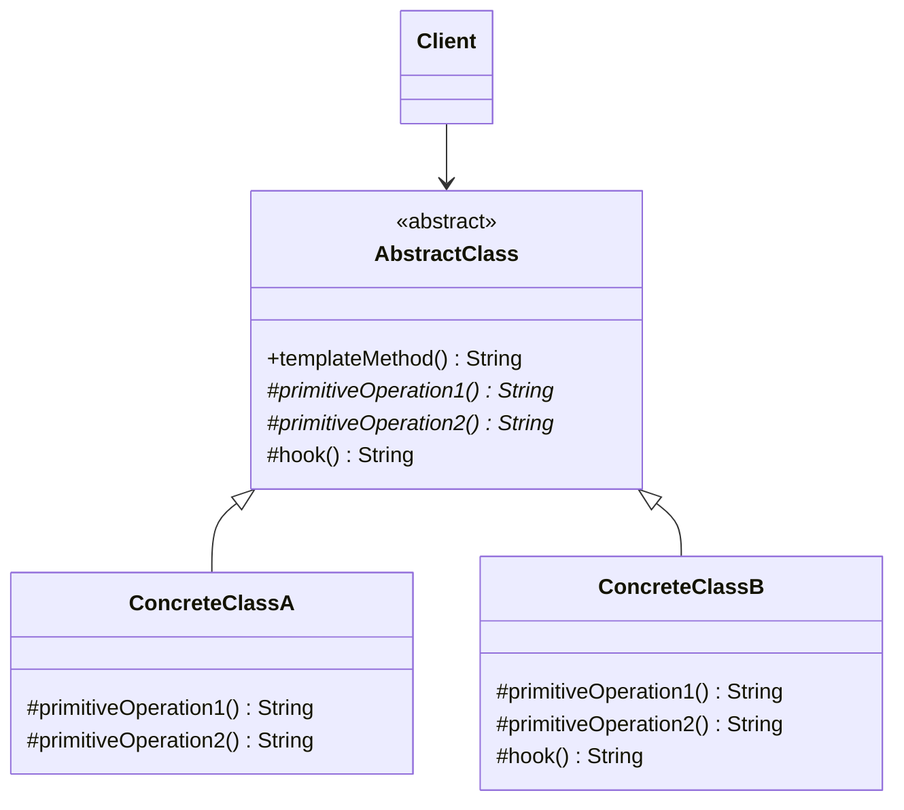

# 📝 Template Method

*Behavioural pattern.*

## Intent

Define the skeleton of an algorithm in an operation, deferring some steps to
subclasses. Template Method lets subclasses redefine certain steps of an
algorithm without changing the algorithm's structure [1, p. 325].

## Motivation

An application framework that opens a document must always perform the same
sequence, such as checking the file, creating the document object, adding it
to the open set and reading its contents, but only the application knows how
to create and read *its* documents. Writing the sequence once in an abstract
base class, with the variable steps declared abstract, fixes the order and
reuses the invariant parts while leaving the specifics to subclasses. The base
class calls the subclass, not the other way round, which Freeman and Robson
call the Hollywood principle: "don't call us, we'll call you" [3, ch. 8].

## Structure



## Participants

| Role [1] | Responsibility | Java | Python | TypeScript | JavaScript |
|---|---|---|---|---|---|
| AbstractClass | `templateMethod()` fixes the algorithm as `primitiveOperation1()` then `primitiveOperation2()` then `hook()`. The primitive operations are abstract; the hook has a default (empty) implementation. | [`AbstractClass`](../../java/src/main/java/com/penapereira/patterns/templatemethod/AbstractClass.java) | [`AbstractClass`](../../python/src/patterns/templatemethod/abstract_class.py) (`template_method`, `primitive_operation_1`, `primitive_operation_2`, `hook`) | [`AbstractClass`](../../typescript/src/template-method/template-method.ts) | [`AbstractClass`](../../javascript/src/template-method/template-method.js) |
| ConcreteClass | Implement the primitive operations; may override the hook. | [`ConcreteClassA`](../../java/src/main/java/com/penapereira/patterns/templatemethod/ConcreteClassA.java), `ConcreteClassB` | `ConcreteClassA`, `ConcreteClassB` | `ConcreteClassA`, `ConcreteClassB` | `ConcreteClassA`, `ConcreteClassB` |
| Client | Calls the template method through the abstract type. | [`TemplateMethodExample`](../../java/src/main/java/com/penapereira/patterns/templatemethod/TemplateMethodExample.java) | `TemplateMethodExample` | [`templateMethodExample`](../../typescript/src/template-method/example.ts) | [`templateMethodExample`](../../javascript/src/template-method/example.js) |

Gamma et al. distinguish *abstract operations*, which subclasses must
implement, from *hook operations*, which provide default behaviour subclasses
may extend [1, p. 328]. `ConcreteClassB` overrides the hook; `ConcreteClassA`
inherits the default.

## The example

The client instantiates each concrete class through the abstract type and
calls the template method:

```
Executing Template Method Pattern Implementation
  ConcreteClassA.primitiveOperation1 then ConcreteClassA.primitiveOperation2
  ConcreteClassB.primitiveOperation1 then ConcreteClassB.primitiveOperation2 with hook
```

The word `then` comes from the base class, the rest from the subclasses; the
trailing ` with hook` appears only where the hook is overridden. Run it with
`make run P=template-method`.

## Consequences

* **Code reuse.** The invariant part of the algorithm is written once.
* **Inverted control structure.** The parent class calls operations of the
  subclass. Subclass authors must understand which operations are hooks and
  which are abstract.
* **Rigidity.** The variation is chosen at compile time through inheritance.
  When the steps must be swappable at run time, or when a class would need to
  vary along several independent axes, Strategy's composition-based approach
  is preferable. Bloch's advice to favour composition over inheritance and to
  document a class's self-use pattern if it is designed for inheritance both
  bear directly on this pattern [2, Items 18 and 19].

## Language notes

* **Java.** `templateMethod()` is `final`, following the advice that the
  skeleton itself should not be overridable [1, p. 328]; the primitive
  operations are `protected abstract`. `java.util.AbstractList` is a large
  template: `iterator()` and `indexOf()` are written in terms of the abstract
  `get(int)` and `size()`. `HttpServlet.service()` dispatching to `doGet()` and
  `doPost()` is another.
* **Python.** `abc.ABC` and `@abstractmethod` enforce the primitive
  operations at instantiation; there is no `final`, so the doc, not the
  language, protects the skeleton. `unittest.TestCase.run()` calling `setUp`,
  the test method and `tearDown` is the standard-library template method.
* **TypeScript.** `abstract class` with `protected abstract` operations; there
  is no `final` keyword, so the skeleton is protected by convention only.
* **JavaScript.** The base primitive operations throw, so a subclass that
  forgets one fails at the first call; the hook has a real default. Lifecycle
  methods in UI frameworks (`componentDidMount` and friends) are hooks in
  exactly this sense.

## Related patterns

* **Factory Method** is often called from within a template method; the
  Factory Method example in this collection is structured that way.
* **Strategy** uses delegation to vary the entire algorithm; Template Method
  uses inheritance to vary part of it.

## References

See [`references.md`](../references.md).

1. Gamma, Helm, Johnson and Vlissides, *Design Patterns*, pp. 325–330.
2. Bloch, *Effective Java*, 3rd ed., Items 18–20.
3. Freeman and Robson, *Head First Design Patterns*, 2nd ed., ch. 8.
