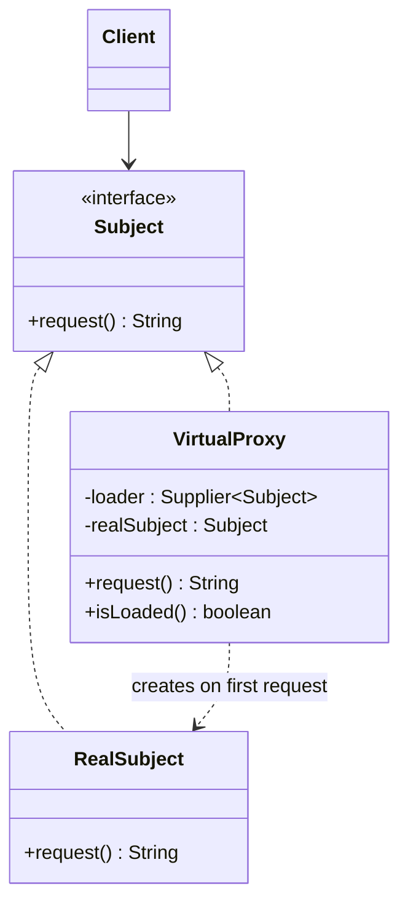

# 🍬 Virtual Proxy

*Structural pattern. A variant of* Proxy, *also known as* Surrogate.

## Intent

Provide a surrogate or placeholder for another object to control access to it
[1, p. 207]. A **virtual proxy** creates an expensive object on demand: the
proxy stands in for it until a request actually needs the real thing.

## Motivation

A document editor embeds images that are costly to load, yet a document should
open instantly even if it contains many. An `ImageProxy` records only the
image's file name and size; it draws a placeholder until `draw()` is first
called, then loads the real image and forwards to it from then on. The
document never knows the difference: the proxy and the image share one
interface [1, p. 208].

## Structure



## Participants

| Role [1] | Responsibility | Java | Python | TypeScript | JavaScript |
|---|---|---|---|---|---|
| Subject | The common interface of real subject and proxy. | [`Subject`](../../java/src/main/java/com/penapereira/patterns/virtualproxy/Subject.java) | [`Subject`](../../python/src/patterns/virtualproxy/subject.py) (Protocol) | [`Subject`](../../typescript/src/virtual-proxy/subject.ts) | implicit: any object with `request()` |
| RealSubject | The expensive object the proxy stands in for. | [`RealSubject`](../../java/src/main/java/com/penapereira/patterns/virtualproxy/RealSubject.java) | [`RealSubject`](../../python/src/patterns/virtualproxy/real_subject.py) | [`RealSubject`](../../typescript/src/virtual-proxy/real-subject.ts) | [`RealSubject`](../../javascript/src/virtual-proxy/real-subject.js) |
| Proxy | Creates the real subject through its loader on the first request and forwards every request to it. | [`VirtualProxy`](../../java/src/main/java/com/penapereira/patterns/virtualproxy/VirtualProxy.java) | [`VirtualProxy`](../../python/src/patterns/virtualproxy/virtual_proxy.py) (`request`, `is_loaded`) | [`VirtualProxy`](../../typescript/src/virtual-proxy/virtual-proxy.ts) | [`VirtualProxy`](../../javascript/src/virtual-proxy/virtual-proxy.js) |
| Client | Uses the subject through the `Subject` interface. | [`VirtualProxyExample`](../../java/src/main/java/com/penapereira/patterns/virtualproxy/VirtualProxyExample.java) | [`VirtualProxyExample`](../../python/src/patterns/virtualproxy/example.py) | [`virtualProxyExample`](../../typescript/src/virtual-proxy/example.ts) | [`virtualProxyExample`](../../javascript/src/virtual-proxy/example.js) |
## The example

The client hands the proxy a loader that counts how often it runs, checks that
nothing has been created yet, makes two requests, then checks again:

```
Executing Virtual Proxy Pattern Implementation
  Proxy created, real subject loaded: false
  RealSubject.request()
  RealSubject.request()
  Real subject loaded: true, created 1 time
```

Run it with `make run P=virtual-proxy`.

## Consequences

* **Deferred cost.** Objects that are never used are never created; start-up
  is fast.
* **Transparent to clients**, which hold a `Subject` either way.
* **The first request pays the creation cost**, which may surprise callers
  expecting uniform latency.
* **Thread safety** of the lazy check is the proxy's responsibility where
  threads exist (the same check-then-act as Singleton's lazy initialisation).

## Language notes

* **Java.** Hibernate and JPA return lazy-loading proxies for associations,
  created with bytecode generation; `java.lang.reflect.Proxy` can build one by
  hand. The loader here is a `Supplier<Subject>`. Bloch discusses lazy
  initialisation and when it is worth it [2, Item 83].
* **Python.** `functools.cached_property` is lazy initialisation of one
  attribute; Django's `SimpleLazyObject` and Werkzeug's `LocalProxy` are full
  virtual proxies built on `__getattr__`. The loader is a `Callable[[], Subject]`.
* **TypeScript.** Dynamic `import()` returns a module lazily and is the
  platform's virtual proxy for code; the built-in `Proxy` object can defer
  creating the target inside its `get` trap.
* **JavaScript.** `loading="lazy"` on images is the motivating example made
  declarative. A closure over a `let real` variable is the minimal form.

## Related patterns

* **Protection Proxy**: same structure, different purpose; see
  [protection-proxy.md](protection-proxy.md).
* **Singleton**: lazy initialisation with the same check-then-act hazard.
* **Flyweight**: a factory that creates on first request and shares thereafter.

## References

See [`references.md`](../references.md).

1. Gamma, Helm, Johnson and Vlissides, *Design Patterns*, pp. 207–217.
2. Bloch, *Effective Java*, 3rd ed., Item 83.
3. Freeman and Robson, *Head First Design Patterns*, 2nd ed., ch. 11.
