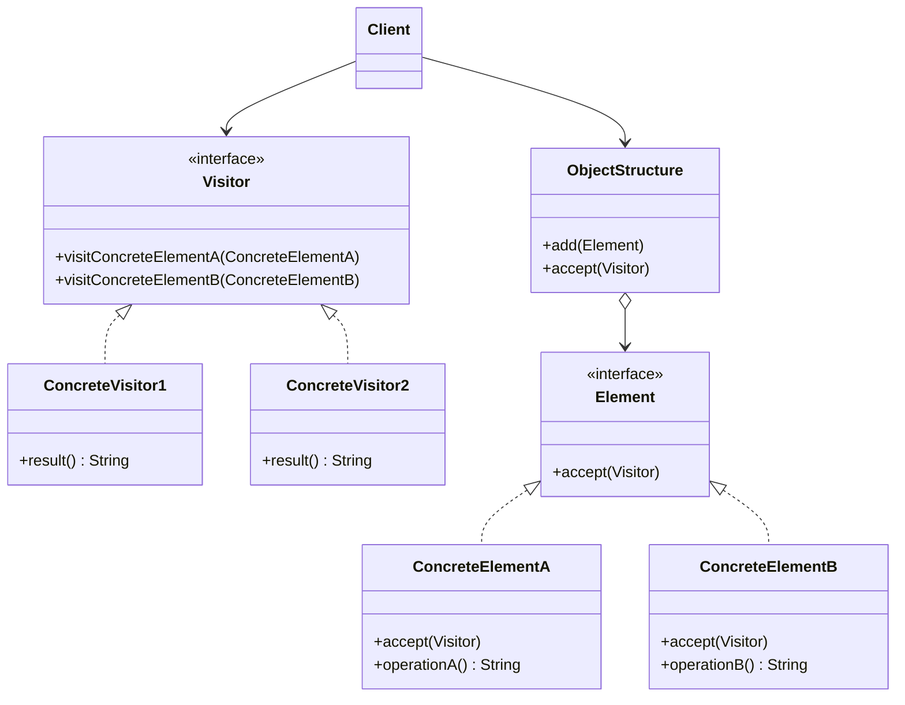

# 🏃 Visitor

*Behavioural pattern.*

## Intent

Represent an operation to be performed on the elements of an object structure.
Visitor lets you define a new operation without changing the classes of the
elements on which it operates [1, p. 331].

## Motivation

A compiler represents a program as an abstract syntax tree and must perform
many operations on it: type checking, pretty printing, code generation,
metrics. Adding each operation as a method on every node class scatters one
concern over the whole hierarchy and forces every node to change whenever an
operation is added. Visitor packages each operation in its own class with one
`visit` method per node type. A node's `accept(visitor)` calls back the visit
method for *its* class, so the operation is chosen by the visitor's class and
the node's class together: *double dispatch* [1, p. 338]. New operations are
new visitor classes; the node classes never change.

## Structure



## Participants

| Role [1] | Responsibility | Java | Python | TypeScript | JavaScript |
|---|---|---|---|---|---|
| Visitor | Declares a visit operation for each concrete element class. | [`Visitor`](../../java/src/main/java/com/penapereira/patterns/visitor/Visitor.java) | [`Visitor`](../../python/src/patterns/visitor/__init__.py) (Protocol) | [`Visitor`](../../typescript/src/visitor/visitor.ts) | implicit: any object with the two visit methods |
| ConcreteVisitor | Implements one operation across all element classes, accumulating a result. | [`ConcreteVisitor1`](../../java/src/main/java/com/penapereira/patterns/visitor/ConcreteVisitor1.java), `ConcreteVisitor2` | `ConcreteVisitor1`, `ConcreteVisitor2` | `ConcreteVisitor1`, `ConcreteVisitor2` | `ConcreteVisitor1`, `ConcreteVisitor2` |
| Element | Declares `accept(visitor)`. | [`Element`](../../java/src/main/java/com/penapereira/patterns/visitor/Element.java) | `Element` (Protocol) | `Element` | implicit: any object with `accept` |
| ConcreteElement | Implements `accept` by calling the visit method for its own class. | [`ConcreteElementA`](../../java/src/main/java/com/penapereira/patterns/visitor/ConcreteElementA.java), `ConcreteElementB` | `ConcreteElementA`, `ConcreteElementB` | `ConcreteElementA`, `ConcreteElementB` | `ConcreteElementA`, `ConcreteElementB` |
| ObjectStructure | Enumerates its elements and lets a visitor visit each. | [`ObjectStructure`](../../java/src/main/java/com/penapereira/patterns/visitor/ObjectStructure.java) | `ObjectStructure` | `ObjectStructure` | `ObjectStructure` |
| Client | Creates visitors and applies them to the structure. | [`VisitorExample`](../../java/src/main/java/com/penapereira/patterns/visitor/VisitorExample.java) | `VisitorExample` | [`visitorExample`](../../typescript/src/visitor/example.ts) | [`visitorExample`](../../javascript/src/visitor/example.js) |

## The example

Two elements sit in an object structure. Two unrelated operations are applied
to them without changing the element classes: one records which classes it
visited, the other concatenates what each element computes:

```
Executing Visitor Pattern Implementation
  ConcreteVisitor1: visited ConcreteElementA, visited ConcreteElementB
  ConcreteVisitor2: A+B
```

Run it with `make run P=visitor`.

## Consequences

* **Adding new operations is easy**: one new visitor class.
* **Gathers related operations** in one class and separates unrelated ones.
* **Adding new element classes is hard**: every visitor gains a method. Visitor
  suits structures whose classes are stable and whose operations change; the
  opposite trade-off from a method per class.
* **Visiting across class hierarchies** works where an Iterator cannot, since
  the elements need not share an interface beyond `accept`.
* **Accumulating state** lives naturally in the visitor.
* **Breaking encapsulation**: elements often have to expose internals so
  visitors can do their work.

## Language notes

* **Java.** The pattern is pervasive in compilers and tooling
  (`javax.lang.model.element.ElementVisitor`, ASM's `ClassVisitor`, ANTLR
  visitors). Since Java 21, pattern matching for `switch` over a `sealed`
  hierarchy gives exhaustive dispatch without an `accept` method, which is
  the modern alternative when the element hierarchy is closed.
* **Python.** Double dispatch is often replaced by
  `functools.singledispatch(method)` on the visitor, dispatching on the
  element's type at run time, or by a dict from type to handler; the `ast`
  module's `NodeVisitor` uses method-name lookup (`visit_<ClassName>`). The
  explicit `accept` form is kept to mirror the diagram.
* **TypeScript.** A discriminated union with an exhaustive `switch` on
  `kind` is the idiomatic alternative and gives compile-time completeness
  checks; the class-based `accept` form shown avoids the union but not the
  need to extend every visitor when an element class is added.
* **JavaScript.** Without types the visitor is a set of methods keyed by
  element class; `accept` remains the only way to dispatch on the element's
  class without `instanceof` chains. Babel's traversal API is a Visitor.

## Related patterns

* **Composite**: visitors are commonly applied to composite structures.
* **Interpreter**: the interpretation of an abstract syntax tree can be a
  visitor.
* **Iterator** traverses the elements; Visitor performs an operation on each.

## References

See [`references.md`](../references.md).

1. Gamma, Helm, Johnson and Vlissides, *Design Patterns*, pp. 331–344.
